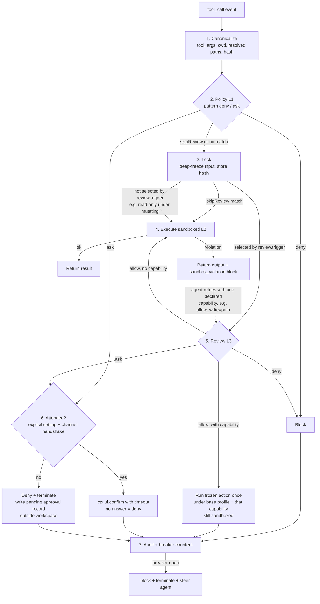

# pi-enclave

**Sandbox-first auto mode for [pi](https://github.com/earendil-works/pi).**

An extension that lets you hand pi a task and walk away — with an OS-enforced sandbox as the
primary control, deterministic policy as the second, and an isolated model reviewer for
mutations and boundary crossings — never for the decisions that must be deterministic.
Designed to be trustworthy **offline, with open-weight models**.

> [!IMPORTANT]
> **Status: Phases 1 and 2 implemented — deterministic auto mode. Phases 3–5 are still
> design.**
>
> **Built and tested:** the OS-enforced sandbox (L2), the deterministic policy layer (L1),
> human escalation (L4), the action lock, the circuit breaker, the audit log, and the
> configuration fold. `bash`, `!`/`!!`, and all six file tools run under Seatbelt on macOS
> and bubblewrap on Linux; pattern rules, the tool allowlist, attendance and pending
> approval records work offline with no model involved at all. Both halves of the
> [platform matrix](#platform-matrix) run as executable suites, each row with a control
> proving it fails when the mechanism it names is removed. See the
> [Phase 1 plan](docs/phase-1-plan.md), the [Phase 2 plan](docs/phase-2-plan.md) and the
> [sandbox-runtime findings](docs/step-0-srt-findings.md).
>
> **Not built:** the reviewer (L3) and everything that only exists for it — the prose
> rulebook, `review.trigger` values other than `boundary`, the read-only classification
> table, `rules critique`, the eval corpus. Also the egress proxy, the Docker backend and
> the ops profile. Sections describing them are commitments to be tested, not descriptions
> of working software. `reviewer.model` must be the literal `"none"`; a named model is
> **refused** rather than silently ignored.
>
> **Known gaps in what *is* built** are listed under [Phase 1 status](#phase-1-status) and
> [Phase 2 status](#phase-2-status).

### API baseline

Every integration claim below is made against a specific pi:

| | |
|---|---|
| Repository | [`earendil-works/pi`](https://github.com/earendil-works/pi) (formerly `badlogic/pi-mono`; not the unrelated `badlogic/pi` GPU-pod CLI) |
| Package | `@earendil-works/pi-coding-agent` |
| Supported range | **`>=0.84.2 <0.85.0`** — bounded on both sides |
| Reference commit | [`c49906e`](https://github.com/earendil-works/pi/tree/c49906ec77788625aacbdc53ebca6fbe65bd20f5) — all file and doc links in this README are pinned to it |
| Fork for core changes | [`frycm/pi`](https://github.com/frycm/pi) — always rebased onto the **latest stable upstream release**; carries only the patches listed under [core changes](#core-changes-to-propose-to-pi) |

pi-enclave declares the range as a `peerDependency` and `probe()` **fails closed outside
it** — on an older pi *and* on a newer one. A newer minor may change hook semantics (handler
ordering, `tool_call` result shape, tool operation interfaces) in ways the conformance suite
has not seen, and "probably fine" is not a sandbox guarantee.

Moving the baseline is one PR that does all of the following together, or none of it:

1. Rebase `frycm/pi` onto the new upstream stable tag and re-apply the core-change patches.
2. Update this table (range, reference commit) and every pinned link in the README.
3. Re-run the backend-conformance suite and the platform matrix against the new pi.
4. Widen the `peerDependency` range.

Until that PR lands, users on the newer pi get a refusal with the exact range and a pointer
to this section, not a silently different security model.

---

## Contents

- [Why this exists](#why-this-exists)
- [Goals and non-goals](#goals-and-non-goals)
- [Threat model](#threat-model)
- [Architecture](#architecture)
- [Sandbox backends](#sandbox-backends)
- [Pi integration](#pi-integration)
- [Policy model](#policy-model)
- [Reviewer](#reviewer)
- [Escalation and failure semantics](#escalation-and-failure-semantics)
- [Server-ops profile](#server-ops-profile)
- [Prior art, reuse and credits](#prior-art-reuse-and-credits)
- [Delivery plan](#delivery-plan)
- [Phase 1 status](#phase-1-status)
- [Phase 2 status](#phase-2-status)
- [Core changes to propose to pi](#core-changes-to-propose-to-pi)
- [Open questions and risks](#open-questions-and-risks)
- [License](#license)

---

## Why this exists

Two pi extensions already do tool-call gating, and both are good at what they do:

- **[pi-automode](https://github.com/czottmann/pi-automode)** has the best policy and
  configuration model — tiered rules (`hard_deny` / `soft_deny` / `allow`), `$defaults`
  extension, and shared project config that can only *add* restrictions. Its README states
  plainly that it is not a sandbox, and it has no denial circuit breaker.
- **[pi-approval-guardian](https://github.com/mics8128/pi-approval-guardian)** has the best
  integrity mechanics — direct-user-input provenance tracking, deep-frozen approved tool
  input, a fail-closed circuit breaker, and a reviewer restricted to read-only tools. Its
  coverage is narrower, it has no reviewer-driven `ask` outcome, and it is also not a sandbox.

Neither contains the piece that matters most. Both operate entirely inside the pi process:
an *approved* `bash` call still runs with the user's full privileges, so a single wrong
allow-decision can read `~/.ssh`, exfiltrate over the network, or modify the machine.

OpenAI Codex and Claude Code both converged on the same answer, and it is not a smarter
classifier — it is the kernel:

| | Mechanism |
|---|---|
| **macOS** | Seatbelt (`sandbox-exec`) with a generated deny-by-default profile |
| **Linux** | bubblewrap namespaces + seccomp BPF |
| **Network** | A local proxy that is the *only* egress path, enforcing a domain allowlist |
| **Model review** | For what the boundary permits but the user might not want — mutations by default, and any action that wants to cross the boundary |

pi-enclave adopts that shape and plugs it into pi's existing extension API — which already
exposes everything required: built-in tool overrides with pluggable operations, a
`user_bash` hook for `!` commands, a `tool_call` hook with `block` and `terminate`, and
`ctx.ui.confirm`.

> **Thesis.** Put the security in the kernel, the hard lines in deterministic rules, and the
> model reviewer in the gap between them — judging what the sandbox permits but the user
> might not want. With a local 8–30B reviewer that gap has to be bounded by the sandbox on
> every side, because that reviewer is the most injectable component in the system.

---

## Goals and non-goals

### Goals

- Run pi unattended for a whole task with the same confidence as Codex `workspace-write`
  or Claude Code auto mode.
- Work **fully offline**: a local reviewer model, no cloud dependency anywhere in the
  control path.
- Native sandboxing on macOS and Linux; Docker as the portable fallback and the Windows answer.
- Cover *every* execution path pi has: built-in tools, `!` user bash, and — by policy —
  custom and MCP tools.
- Two first-class profiles: **dev** (workspace-write) and **ops** (offline server management).
- Exact action binding: what was approved is what runs, once.

### Non-goals

- Protecting against a malicious pi *extension* loaded into the same process. That requires
  isolating pi itself in a VM or container — documented as the outer ring, not solved here.
- Kernel-exploit-grade isolation. Seatbelt and bwrap are the bar; a microVM backend is a
  later option.
- A general DLP system. Secret handling is limited to path deny-lists and proxy-side
  credential masking.
- Native Windows sandboxing. On Windows the answer is the Docker backend.

---

## Threat model

| Threat | Primary control | Backup |
|---|---|---|---|
| Prompt injection via repo files, tool output, or fetched content steering the agent to run `curl … \| sh`, read `~/.ssh`, or push secrets | Sandbox: filesystem deny-read on secrets, no network except the proxy allowlist | Pattern `deny` rules; reviewer |
| Injection aimed at the **reviewer** (text in arguments or messages telling it to allow) | Reviewer sees structured, provenance-labelled evidence only; only direct TUI/RPC input can carry authorization | A reviewer `allow` can only widen the sandbox by one declared capability for one action — it can never produce unsandboxed host execution, so the sandbox still bounds a wrong allow |
| Agent tampers with pi-enclave's own state (approval records, config) from inside the sandbox | All extension state lives outside every writable root, mode `0600`, written atomically; project-local config is tighten-only | Session-bound nonces and expiry on approval records |
| Exfiltration to an **allowed** host (`network.allowHosts` contains `github.com`; the agent pushes secrets to any repo there) | Not prevented by a domain allowlist — see [residual risks](#residual-risks) | `readDeny` on secrets; credential masking in the proxy (v2); `network.mode: "off"` by default |
| Honest agent mistake (`rm -rf` on the wrong path, `git push --force`) | Pattern `ask` rule → L4; otherwise the reviewer's prose `soft_deny` rulebook | Sandbox write roots |
| Workaround loops after a denial (same goal, different command) | Circuit breaker: `block` + `terminate` after N equivalent denials | Audit log |
| TOCTOU: input mutated between approval and execution by a later `tool_call` handler | Canonicalize → hash → deep-freeze → execute the frozen snapshot | Refuse auto mode when untrusted repo-local extensions are loaded |
| Reviewer outage (local model OOM, runtime restart) | Bounded retry, then deny and stop the turn (unattended) or `ask` (attended) | — |
| Sandbox bypass through tools that do not go through `bash` (custom / MCP tools) | Auto mode denies any tool not in the allowlist; allowlisted tools are declared read-only or reviewed | Outer container or VM |

---

## Architecture

Four layers. The numbering is by *trust*, not by execution order: L1 and L2 are
deterministic and cannot be talked out of a decision; L3 is a model; L4 is a human. The
execution order for one action is **L1 → lock → (L3 if the action is selected by
`review.trigger` or carries a capability request) → L2 → (L3 again only for a capability retry after a violation) → L4 on
any `ask`**. Which L1 survivors go to L3 is decided by the configured `review.trigger`:
under the `mutating` default read-only actions skip L3; under `all` nothing does. The only
explicit bypass of the trigger is a `rules.skipReview` match. What stays invariant is that
L2 always runs and that no layer below L4 can remove it.

| Layer | Name | What it does |
|---|---|---|---|
| **L1** | Deterministic rules | Pattern rules on tool and arguments with exactly two verbs: `deny` (never runs, nothing below can override) and `ask` (always a human decision, the reviewer cannot auto-approve it), plus protected paths. Never touches a model. Runs before everything else in under a millisecond. |
| **L2** | **OS enforcement** | Every shell command **and every file/search operation** executes inside a Seatbelt / bwrap / Docker boundary: explicit writable roots (everything else read-only), declared paths and secrets denied for reading, network only via the egress proxy. Note the asymmetry, which the backends impose and pi-enclave inherits: **writes are an allow-list, reads are a deny-list.** There is no way to say "the agent may only read the workspace"; anything absent from the read-deny list is readable. An L3 `allow` still lands here; so does a `skipReview` match. Sandbox denials are returned to the agent as a structured violation, which is the only way a request can *widen* the profile (via an L3-reviewed capability retry). |
| **L3** | Isolated model reviewer | For every action L1 did not decide that is either selected by `review.trigger` (`mutating` by default; `all` selects read-only actions too; `boundary` selects none) or a request to widen the sandbox by one declared capability (`--allow-write <path>`, `--allow-host <host>`) for one action. Judges it against a **prose rulebook** (`review.environment` / `hard_deny` / `soft_deny` / `allow`) and the user's direct authorization. Fresh completion, own system prompt, structured evidence, strict JSON output with `allow` / `deny` / `ask`. **An L3 `allow` never leaves the sandbox** — it re-runs the locked action under a one-shot profile that is the base profile plus exactly the requested capability. |
| **L4** | Human escalation | Attended: `ctx.ui.confirm` with the exact canonical action. Unattended: `ask` means deny, stop the turn, and write a resumable "needs approval" record outside the workspace. Unsandboxed host execution, if a profile permits it at all, is reachable **only** from this layer. |

Three cross-cutting mechanisms: the **action lock** (canonical snapshot, hashed, frozen,
executed once), the **circuit breaker** (per-turn and sliding-window denial counters), and
the **audit log** (JSONL, one record per decision, including sandbox violations).

**Monotonic escalation.** Each layer can only make the effective sandbox *wider by a declared,
bounded amount* and never *absent*: L1 cannot widen it at all, L3 can add one capability to
one action, and only L4 (a human, through a verified channel) can authorize host execution.
This is the invariant the rest of the document protects.

### Decision path for one tool call



Every L1 survivor is locked **before** anything else sees it, including the reviewer: L3
receives the frozen snapshot's hash, and both `E` and `RUN` execute that snapshot, so a later
`tool_call` handler cannot change what was reviewed. The flowchart has one lock node on
purpose.

Step 7 matters as much as the rest: when the breaker opens, the agent is steered with
"do not pursue this outcome by other means" — the denial is about the *outcome*, not the
particular command.

---

## Sandbox backends

The backend is a small interface. The profile — what is readable, writable and reachable —
is backend-independent and compiled per backend at session start. Selection order:
native for the host OS → Docker → **refuse to enter auto mode**. There is no silent
unsandboxed fallback.

```ts
interface SandboxBackend {
  readonly id: "seatbelt" | "bwrap" | "docker";
  probe(): Promise<{ ok: boolean; reasons: string[] }>;      // deps, userns, daemon…
  compile(profile: SandboxProfile): Promise<CompiledProfile>; // .sbpl / bwrap argv / docker spec
  run(action: LockedAction, compiled: CompiledProfile,
      io: { onData(b: Buffer): void; signal?: AbortSignal; env: ChildEnv })
    : Promise<{ exitCode: number | null; violations: Violation[] }>;
  // fs ops backing the read/edit/write/grep/find/ls overrides. Each call is executed by a
  // sandboxed helper process under `compiled` — the pi process never touches the path itself.
  fs(compiled: CompiledProfile): ReadOperations & WriteOperations & EditOperations
                                 & GrepOperations & FindOperations & LsOperations;
  // Widen `compiled` by exactly one declared capability for one action (L3 allow).
  extend(compiled: CompiledProfile, cap: Capability): Promise<CompiledProfile>;
}

type Capability =
  | { kind: "write"; path: string }          // one extra writable path (file or directory)
  | { kind: "read"; path: string }           // lift one readDeny entry
  | { kind: "host"; host: string; port: number };  // one extra proxy-allowed host

interface SandboxProfile {
  mode: "read-only" | "workspace-write" | "custom";
  writableRoots: string[];   // workspace, scratch, $TMPDIR, optional extras
  readDeny: string[];        // ~/.ssh, ~/.aws, ~/.gnupg, ~/.pi/**/auth*, keychains…
  readAllow?: string[];      // custom mode only
  network: { mode: "off" | "proxy"; allowHosts: string[]; allowLocalPorts: number[] };
  capabilities: "none" | "reviewed";  // may the agent request a one-shot Capability (→ L3)?
  hostExec: "never" | "human";        // may a HUMAN (L4, never L3) approve an unsandboxed run?
  pty: boolean;
  env?: { passthrough?: string[] };  // extra host vars to forward, by exact name; user-global only
}
```

`hostExec` defaults to `"never"`. There is deliberately no `"reviewer"` value: nothing a model
says can produce unsandboxed execution.

### The child environment is built, not inherited

Protecting `~/.aws` and `~/.pi/**/auth*` on disk is pointless if `ANTHROPIC_API_KEY` and
`AWS_SECRET_ACCESS_KEY` arrive in the sandboxed shell through `process.env`: `env`, `$VAR`
expansion, and every child process would see them, and `echo $KEY > notes.txt` moves them
into the writable workspace for later disclosure. `backend.run` therefore never receives
`process.env`. It receives a `ChildEnv` that pi-enclave **constructs** from an allowlist:

```ts
type ChildEnv = Readonly<Record<string, string>>;  // complete; nothing else is set

const CHILD_ENV_BASE = [
  "PATH", "HOME", "USER", "LOGNAME", "SHELL", "TERM", "LANG", "LC_ALL", "LC_CTYPE",
  "TZ", "TMPDIR", "XDG_CACHE_HOME", "XDG_CONFIG_HOME", "XDG_DATA_HOME",
  "COLORTERM", "NO_COLOR", "FORCE_COLOR", "CI",
];
```

- **Only the base list and `env.passthrough` are copied** from the pi process, by exact
  name. Everything else is absent — not unset-then-inherited, but never present in the
  `execve` environment at all.
- **`passthrough` is user-global only** (monotonic rule: a project cannot add a variable)
  and refuses names matching the credential deny pattern below, even if listed.
- **A credential deny pattern is applied last**, so neither `passthrough` nor a future base
  addition can leak by mistake: `*_API_KEY`, `*_SECRET*`, `*_TOKEN`, `*PASSWORD*`,
  `*CREDENTIAL*`, `AWS_*`, `GOOGLE_APPLICATION_CREDENTIALS`, `AZURE_*`, `OPENAI_*`,
  `ANTHROPIC_*`, `GH_TOKEN`, `GITHUB_TOKEN`, `NPM_TOKEN`, `SSH_AUTH_SOCK`, `GPG_AGENT_INFO`,
  `KUBECONFIG`, `DOCKER_HOST`, `PI_*`. The list is the default `envDeny` in `$defaults` and
  can be extended, never shortened, below user-global.
- `HOME` and `TMPDIR` are rewritten to the sandbox's view (`$TMPDIR` is a writable root; the
  real home is not), and `PATH` is filtered to entries under read-allowed roots. Under
  sandbox-runtime the child's `TMPDIR` is `/tmp/claude` (or `CLAUDE_CODE_TMPDIR`), which SRT
  makes writable in every profile; pi-enclave advertises it as a writable root rather than
  describe a narrower sandbox than the one in force, and denies every other SRT default
  that is not a device node.
- **Provider credentials stay in the pi parent.** The reviewer call, the session model and
  the egress proxy's credential masking all run in pi's process; nothing inside the sandbox
  needs a credential to do the task, and if a task genuinely does (a deploy key for a
  `git push` to an allowed host) that is what v2 proxy-side masking is for.
- The Docker backend builds the same `ChildEnv` into `docker exec -e`; it does not rely on
  the container having a clean environment by accident.

**Conformance case.** For every backend: set `ANTHROPIC_API_KEY`, `AWS_SECRET_ACCESS_KEY`,
`GITHUB_TOKEN` and a `passthrough`-listed `FOO_TOKEN` in the pi process, then run `env`,
`sh -c 'echo $ANTHROPIC_API_KEY'`, `python3 -c 'import os; print(os.environ)'`, and
`cat /proc/self/environ` (Linux) inside the sandbox. The expected output contains none of
the four values; `FOO_TOKEN` is additionally rejected at config load with a diagnostic.

### File and search tools are OS-enforced too

The six file tools (`read`, `edit`, `write`, `grep`, `find`, `ls`) are **not** enforced by
resolved-path checks in the pi process. Those checks run in a privileged process, are not an
OS boundary, and are exposed to symlink and TOCTOU races (the agent can swap a path component
for a symlink between the check and the `open`). Instead each backend's `fs()` dispatches
every operation to a small **sandboxed helper** (`pi-enclave-fs`) that runs under the same
compiled profile as `bash`: the helper is started by `backend.run`, speaks a length-prefixed
JSON protocol over its stdio, and performs the actual `open`/`readdir`/`rg` call from inside
the boundary. If the kernel denies it, the helper reports a `Violation` exactly as a shell
command would.

This also handles a concrete gap in pi's current `grep` tool: its operations object only
abstracts the filesystem walk, while the tool itself still
[spawns `rg` directly](https://github.com/earendil-works/pi/blob/c49906ec77788625aacbdc53ebca6fbe65bd20f5/packages/coding-agent/src/core/tools/grep.ts#L175-L226)
from the pi process. pi-enclave therefore re-registers `grep` with its own implementation
that runs `rg` inside the helper, rather than reusing `createGrepTool`. Until that is done,
the L2 guarantee is **narrowed to shell execution** and the status line says so; Phase 1 is
not complete until the file tools are behind the helper and the test matrix proves it.

The cost is one extra process per session (the helper is long-lived, one per compiled
profile), not one per call; read latency is measured in Phase 1.

### macOS — Seatbelt

`sandbox-exec -p <generated SBPL> /bin/zsh -c …`, with a deny-by-default base modeled on
Codex's `seatbelt_base_policy.sbpl` (process-exec/fork, a sysctl allowlist, PTY access,
POSIX semaphores and shared memory for Python multiprocessing).

- **Filesystem** — `(allow file-read*)` minus `readDeny` subpaths; `(allow file-write*)`
  only on `writableRoots`, `/dev/null` and scratch.
- **Network** — denied entirely; in `proxy` mode, `network-outbound` to
  `localhost:<proxyPort>` only, plus the minimal mach-lookups needed for DNS and trust
  evaluation.
- **Caveats** — `sandbox-exec` is deprecated-but-universal (Chrome, Codex and Claude Code
  all rely on it). Homebrew under `/opt/homebrew` stays read-only, which is fine. Git
  worktrees outside the cwd need explicit `writableRoots`. Go's TLS stack needs `trustd`,
  which is exposed as an explicit weaker option, off by default.

### Linux — bubblewrap

`bwrap --unshare-user --unshare-pid --unshare-net --new-session --die-with-parent`,
`--ro-bind / /`, `--bind` for writable roots, `--tmpfs` over `readDeny` paths, plus
`--proc` and `--dev`. Seccomp BPF (via `--seccomp`) blocks new `AF_UNIX` and raw sockets
when proxying.

- **Filesystem** — same profile semantics; deny-read is implemented by masking with an
  empty tmpfs rather than by returning an error.
- **Network** — the network namespace is removed. In `proxy` mode a Unix domain socket is
  bound into the sandbox and bridged by `socat` to the host proxy (Claude Code's layout).
- **Caveats** — requires unprivileged user namespaces (Ubuntu 24.04's AppArmor policy may
  block them; `probe()` detects this and prints the sysctl fix). WSL1 is unsupported.
  On hosts without userns (Docker-in-Docker), fall through to the Docker backend rather
  than offering a "weaker nested" mode.

### Docker — fallback and Windows

A long-lived per-session container:
`docker run --rm -d --network none --cap-drop ALL --security-opt no-new-privileges --read-only --pids-limit …`
with the workspace bind-mounted; each action is a `docker exec`.

- **Filesystem** — bind mounts for writable roots, everything else from the image.
  `readDeny` is trivially satisfied: the host home directory is never mounted.
- **Network** — `--network none`, plus an optional sidecar proxy on a user-defined network
  for `proxy` mode.
- **Caveats** — the toolchain must exist in the image (project-defined `Dockerfile`, or a
  default). UID mapping is needed for file ownership. Startup is slower, amortized by the
  session-long container. On macOS, Docker Desktop is a VM — actually *stronger* isolation
  than Seatbelt, with slower I/O.

### Later — microVM

pi's bundled `gondolin` example already routes all built-in tools into a QEMU micro-VM
through the same operations interfaces, which proves the integration surface is sufficient.
Kept out of v1 for startup cost and its Node ≥ 23.6 requirement.

### Egress proxy

A small in-process HTTP CONNECT and SOCKS5 proxy on localhost, started with the session.
It enforces `network.allowHosts`, logs every connection, and (v2) substitutes masked
credentials on egress to allowed hosts only.

The proxy is deliberately **deterministic and model-free**. It never consults the reviewer:
a CONNECT request carries a destination but no evidence of *why*, and a model deciding in the
connection path would be slow, evidence-blind and reachable by attacker-controlled hostnames.
Instead, a denied connection is rejected synchronously (not dropped) and logged with the
current action hash, so the tool output can name the host in its `<sandbox_violation>` block.
The agent then retries with `allow_host=<host>` and the decision is made at L3, where the
locked action, the requested host and the direct user authorization are all visible — see the
[capability retry hatch](#the-capability-retry-hatch). A grant is one host for one action;
a session-scoped host grant is a possible later option, user-global config only.

In `off` mode it is never started — the default for offline use. Local model endpoints
(`localhost:11434` and friends) are reached by **pi itself**, not from inside the sandbox,
so the sandbox needs no network at all for the agent to work.

> [!WARNING]
> **A domain allowlist is not an exfiltration control.** Allowing `github.com` lets a process
> push to *any* repository on `github.com`; allowing `pypi.org` lets it `pip upload`. The
> proxy restricts *where* traffic goes, not *what* it carries, and domain fronting can in some
> cases defeat even that. Upstream sandbox-runtime documents the same
> [residual risk](https://github.com/anthropic-experimental/sandbox-runtime/blob/bcad38810efcc2b7342bbc6ec26d15b7bbbabcfb/README.md#L772-L785).
> The real controls against exfiltration are `readDeny` (the secret is never readable) and
> `network.mode: "off"` (the default). `allowHosts` is a convenience for online dev work and
> is presented as such.

---

## Pi integration

Everything below uses APIs that exist in pi at the [baseline](#api-baseline). pi already
ships an
[SRT-based sandbox extension example](https://github.com/earendil-works/pi/blob/c49906ec77788625aacbdc53ebca6fbe65bd20f5/packages/coding-agent/examples/extensions/sandbox/index.ts)
that overrides `bash`; pi-enclave's contribution is not another Seatbelt/bwrap wrapper but
complete tool coverage, monotonic policy, exact approval binding, auditability and reviewer
evaluation on top of one.

| Need | Pi API | How pi-enclave uses it |
|---|---|---|---|
| Sandbox shell commands | `registerTool({ name: "bash", … })` built from `createBashTool({ operations, spawnHook })` | Override the built-in `bash`. The operations object delegates to `backend.run`. Renderers are inherited; `promptSnippet` and `promptGuidelines` are re-declared so the model learns about capability requests and the violation format. |
| Sandbox file tools | `createReadTool` / `EditTool` / `WriteTool` / `FindTool` / `LsTool` with their `*Operations`; `grep` re-implemented | Same profile, enforced by the [sandboxed helper](#file-and-search-tools-are-os-enforced-too), not by in-process path checks. `grep` cannot be fully redirected through `GrepOperations` today (it spawns `rg` itself), so it is replaced outright. |
| `!` and `!!` user commands | `on("user_bash")` | Routed through the same backend. Guardian lists this as an uncovered bypass; here it is covered by construction. |
| Policy, lock, review, breaker | `on("tool_call")` → `{ block, reason, terminate }` | One handler running steps 1–3 and 5–7. `terminate: true` when the breaker opens. |
| Direct-user provenance | `on("input")`, `on("message_start")` | Record exact pre-expansion TUI/RPC text; only those messages count as authorization evidence. |
| Ask the human | `ctx.ui.confirm(title, message)`, `ctx.mode`, `ctx.hasUI` | Attended escalation, gated by the explicit [attendance contract](#attendance-is-a-setting-not-an-inference) — `hasUI` alone is only used to decide *whether a dialog can be drawn*, never whether a human is present. |
| Steer after a breaker trip | `pi.sendMessage(…, { deliverAs: "steer" })`, `ctx.abort()` | Tell the agent the *outcome* is off-limits, not just the command. |
| Persistence | Session entries, `session_start` / `session_shutdown` | The per-session approval table and breaker state survive resume; a bypass never does. |
| Commands and status | `registerCommand`, status line | `/enclave status\|backend\|violations\|rules\|audit\|pending`, plus the `pi-enclave` binary for anything that happens outside a session. The footer shows backend, mode, attendance in force, breaker state and counts. There is deliberately **no** runtime `on`/`off` toggle: a switch that changes the trust model mid-session is exactly what the lock and the audit log exist to prevent. |

> [!WARNING]
> **Tools pi-enclave does not own.** Tools registered by other extensions execute in the pi
> process with the user's privileges and never touch the sandbox. In auto mode the policy
> layer therefore **denies any tool not in `tools.allow`**. Allowlisted tools may be
> declared `readOnly: true` or `reviewed: true` (which is an `ask` while there is no
> reviewer), and a grant may pin `source` to the `sourceInfo.path` pi reports for the
> registering extension — without a pin, a tool name is not an identity, and whichever
> extension loads first inherits the grant. This is the honest answer until pi core offers
> a sandbox hook for tool execution — see [core changes](#core-changes-to-propose-to-pi).
>
> **pi 0.84.2 has no MCP support at all** — no dependency, no setting, no tool namespace.
> Earlier drafts of this document said "MCP and custom tools"; there is only the second
> kind. An MCP bridge, when one exists, will be an extension registering ordinary tools,
> and the allowlist covers it unchanged.

---

## Policy model

Two separate systems, evaluated in order — the same split Claude Code's auto mode makes
between `permissions.deny` / `permissions.ask` and the classifier's `autoMode` rulebook
([reference](https://code.claude.com/docs/en/auto-mode-config)), tailored to pi's layers:

| | System 1 — `rules` (L1) | System 2 — `review` (L3) |
|---|---|---|---|
| Form | Tool-and-argument **patterns** on the canonical action | **Prose**, read as natural-language rules |
| Verbs | `deny`, `ask` — nothing else | `environment`, `hard_deny`, `soft_deny`, `allow` |
| Evaluated | First, deterministically, before any model | Only for what L1 did not decide |
| Can be overridden by | Nothing: not the reviewer, not user intent, not `review.allow` | Direct user intent (soft tier only) and `review.allow` (soft tier only) |
| Enforced by | Regex + path resolution | A model's reading of the text — **interpreted, not enforced** |
| Belongs here | Anything that must hold under adversarial input: secrets, host exec, force push if you never want it | Everything you would explain to a new engineer: what is internal, what counts as production, which routine mutations are fine |

The Anthropic argument against hand-written command lists is that they are error-prone
*and* give false confidence. The split answers both: the pattern tier shrinks to the handful
of things that must be deterministic, and the prose tier carries the judgement calls in the
form people can actually write. What it does **not** do is let prose become a boundary —
a prose `hard_deny` is only as strong as the local model reading it under injection, which
is why the real hard controls stay `sandbox.*` and `rules.deny`.

There is deliberately **no pattern `allow` by default.** Claude Code keeps narrow shell
allow rules in auto mode and offers `classifyAllShell: true` to suspend them; pi-enclave's
default is the equivalent of that flag. The opt-in `rules.skipReview` list exists for
latency, but it **is an allow verdict**: a match bypasses `review.hard_deny` and
`review.soft_deny` entirely, and the sandbox will not catch a destructive write inside a
writable root or a push to an already-allowed host. It is user-global only, it is rendered
in `pi enclave rules config` under an `ALLOW (skips review)` heading, and `rules critique`
warns about any entry that is a bare command name or ends in `*`.

L1 precedence after the merge is fixed: **`deny` > `ask` > `skipReview`**. An action that
matches both `deny` and `skipReview` is denied; one that matches `ask` and `skipReview` is
asked. Only an action that matches nothing in `deny` or `ask` can be fast-pathed, and only
then does `review.trigger` decide whether the reviewer sees it. The overlap is a
conformance case.

### Precedence inside the reviewer

Borrowed from Claude Code's four tiers and stated verbatim in the reviewer system prompt:

1. `review.hard_deny` blocks. Neither direct user intent nor `review.allow` applies.
2. `review.soft_deny` blocks next.
3. `review.allow` entries are exceptions that clear a matching `soft_deny`.
4. **Direct** user intent clears a remaining soft block when the user's own message
   describes *this specific action*. "Clean up the repo" does not authorize a force push;
   "force-push this branch" does. Only `direct` provenance counts — never `AGENTS.md`, tool
   output or assistant prose.

`review.environment` has no verdicts of its own; it defines what "internal", "production"
and "sensitive" mean for the other three lists, and it is where most users should start
(source-control org, trusted domains, buckets, internal registry, what counts as prod).

The eval corpus asserts each boundary: direct intent must not clear a `hard_deny`; a
`review.allow` must not clear a `hard_deny`; and — trivially, because L1 runs first — no
prose rule reaches an action a pattern `deny` already blocked.

### Configuration sources

| Source | Location | May | May not |
|---|---|---|---|
| Built-in defaults | package | — | — |
| User global | `~/.pi/agent/enclave.json` | Everything: profiles, backend, reviewer model, `rules`, the whole `review` rulebook, tool allowlist | — |
| Project local (untracked) | `.pi/enclave.local.json` | Select a profile, add writable roots *inside* the repo, add `rules.deny` / `rules.ask`, add protected paths, raise `review.trigger` | Touch `rules.skipReview` or **any of the four prose lists** `review.environment` / `hard_deny` / `soft_deny` / `allow`, change the reviewer, disable the sandbox |
| Project shared (tracked) | `.pi/enclave.json` | Add `rules.deny` / `rules.ask`, add protected paths, raise `review.trigger`, declare the Docker image | Anything that relaxes policy, and any of the four prose lists; ignored entirely if the project is not trusted |
| Environment | `PI_ENCLAVE_*` (three variables, listed below) | Force attendance off; select an *already-defined, narrower* profile; disable auto mode | Name a model, backend or any value not already defined in user-global config; relax anything |

### Monotonic configuration rule

The table above is enforced by a single rule rather than by a list of exceptions: **config
sources are ordered by trust, and a less-trusted source can only produce a profile that is
*at most as permissive* as the one it received.** Concretely, the merge is a fold over
`defaults → user global → environment → project local → project shared`, and at each step
the result must satisfy `effective ⊑ incoming` under a partial order defined per field:

| Field | "Narrower" means |
|---|---|
| `profile` (selection) | Only a profile whose *every* field is ⊑ the user-global default profile may be selected. A project cannot pick `dev` if the user's default is `read-only`. |
| `sandbox.writableRoots` | Subset, after resolution, and every added root must be inside the workspace |
| `sandbox.readDeny` | Superset |
| `sandbox.network.allowHosts` | Subset; `mode` may go `proxy → off`, never the reverse |
| `sandbox.capabilities` / `hostExec` | `none ⊑ reviewed`, `never ⊑ human`; may only move left |
| `rules.deny` / `rules.ask` / `rules.protectedPaths.*` | Superset |
| `rules.skipReview` | Subset — user-global only; any project-file entry rejects the file |
| `review.environment` / `hard_deny` / `soft_deny` / `allow` (the four prose lists) | **Immutable below user-global.** Prose has no partial order a merge can check: "append only" is a syntactic superset, not a semantic tightening, and a project-supplied string inside the reviewer prompt is the repo-to-reviewer injection path the threat model excludes. A project file that contains any of these four keys is rejected whole. `review.trigger` is the only `review` key a project may set. |
| `review.trigger` | `boundary ⊑ mutating ⊑ all`; a project file may move it right (review more), never left |
| `tools.allow` | Subset; `readOnly` may become `reviewed`, never the reverse |
| `reviewer`, `backend` | Immutable below user-global |

Environment variables sit between user-global and project-local in the fold, so they obey
the same order. These are the only ones that exist:

| Variable | Values | Monotonic direction |
|---|---|---|---|
| `PI_ENCLAVE_ATTENDED` | `off` | Only turns attendance off. Any other value is a config error. |
| `PI_ENCLAVE_PROFILE` | name of a profile defined in the user-global file | Selection only; the selected profile must be ⊑ the user-global default, exactly as for a project file. It cannot define a profile. |
| `PI_ENCLAVE_AUTO` | `off` | Turns off **L1 and L4 only**: the gate passes everything, the breaker and escalation are dormant, and the status line says `L1 off`. It never removes the sandbox — L2 is the one layer the monotonic rule says nothing may remove, and the process environment is the least trusted place such a request could come from. There is no `on`. |

There is no `PI_ENCLAVE_MODEL` or `PI_ENCLAVE_BACKEND`: the reviewer and the backend are
immutable below user-global because whoever controls the process environment of an ops
runner would otherwise control which model decides and whether a sandbox exists at all.
An ops runner that needs a different reviewer gets a different user-global file.

Any project-local field that would violate the order is not "clamped" — the whole file is
rejected with a diagnostic and auto mode refuses to start, because a half-applied config is
harder to reason about than none. The rule is a pure function with a property-based test
(`merge(a, b) ⊑ a` for all `a`, `b`) that is part of the conformance suite. This is what
makes it safe for `.pi/enclave.json` and `.pi/enclave.local.json` to live in a directory the
sandboxed agent can write to: the worst the agent can do is tighten its own leash.

The fold is only sound for fields with a checkable partial order. Prose has none, which is
why the `review.*` lists follow Claude Code exactly: they are read from the user-global file
and nowhere else, so nothing a repository can write ever reaches the reviewer system prompt.
(`review.trigger` is an enum with a partial order, so it stays project-raisable.)
What a project *can* do to tighten review is deterministic and structured: add `rules.deny`
/ `rules.ask` patterns, add protected paths, and raise `review.trigger`. "Treat `infra/` as
production" is therefore expressed as `"protectedPaths": { "ask": ["infra/**"] }`, not as
a sentence — less expressive, but enforced by path resolution rather than by a model reading
text the agent could have written.

`rules.protectedPaths` is the path-shaped half of L1: `{ "deny": [glob…], "ask": [glob…] }`,
matched against every resolved path the canonical action writes to (file tools directly;
shell commands via the write-target heuristic, with the same "unknown means mutating"
rule as the read-only classifier). Both lists are supersets under the fold.

```json
{
  "profile": "dev",
  "profiles": {
    "dev": {
      "sandbox": {
        "mode": "workspace-write",
        "writableRoots": ["$WORKSPACE", "$TMPDIR", "~/.cache/pi-enclave"],
        "readDeny": ["$defaults"],
        "network": { "mode": "off" },
        "capabilities": "reviewed",
        "hostExec": "never"
      },
      "rules": {
        "deny": ["$defaults"],
        "ask":  ["$defaults", "git push *", "gh pr create *"],
        "skipReview": [],
        "protectedPaths": { "deny": ["$defaults"], "ask": ["infra/**", ".github/workflows/**"] }
      },
      "review": {
        "trigger": "mutating",
        "environment": [
          "$defaults",
          "Source control: github.com/frycm and every repo under it",
          "Trusted internal domains: *.corp.example.com",
          "Sensitive remote targets: any host or k8s namespace containing 'prod'"
        ],
        "hard_deny": [
          "$defaults",
          "Never send repository contents to a third-party API"
        ],
        "soft_deny": [
          "$defaults",
          "Never run database migrations outside the migrations CLI, even against dev databases",
          "Never modify anything under infra/terraform/: infra changes go through review"
        ],
        "allow": [
          "$defaults",
          "Running tests, linters and formatters is routine",
          "Writing to ~/scratch is fine: ephemeral, nothing depends on it"
        ]
      },
      "tools": {
        "allow": { "bash": {}, "read": {}, "edit": {}, "write": {},
                   "grep": {}, "find": {}, "ls": {} }
      },
      "reviewer": { "model": "ollama/qwen3:32b", "timeoutMs": 30000, "fallback": "none" },
      "breaker": { "consecutive": 3, "window": [10, 50] },
      "attended": { "mode": "tui", "confirmTimeoutMs": 300000 }
    }
  }
}
```

`rules.*` matching runs against the canonical action, not raw text: shell commands are
tokenized (pipelines, `&&` and subshells split, each simple command matched) and paths are
resolved. This is the same heuristic both existing extensions use; v2 can swap in a real
shell parser without changing the rule format. `review.*` entries are never matched — they
are spliced, in order, into the reviewer prompt. `"$defaults"` in any list splices the
built-in entries at that position; omitting it takes full ownership of that list, and
`pi enclave rules defaults` prints what is being given up.

`review.trigger` decides which L1-undecided actions the reviewer sees:

| Value | Reviewed | Use |
|---|---|---|---|
| `"boundary"` | Only capability retries after a sandbox violation | Phase 2 deterministic mode — forced when `reviewer.model` is the explicit value `"none"`; every crossing is then an `ask` |
| `"mutating"` (default) | Everything that is not a declared read-only tool or a read-only canonical shell command, plus capability retries | Normal dev work |
| `"all"` | Every action | Auditing a new reviewer, high-sensitivity repos |

### Read-only classification

The `mutating` trigger is only as safe as the predicate that decides what is *not*
mutating, so that predicate is a policy contract, not an implementation detail:

- **Tools.** Read-only if and only if declared `readOnly: true` in `tools.allow`; the
  built-ins `read`, `grep`, `find`, `ls` are; `bash`, `edit`, `write` are not.
- **Shell.** A canonical command is read-only only when **every** simple command in it
  satisfies a built-in predicate table keyed on `command`, `subcommand` and **forbidden
  flags**, e.g. `git (status|log|diff|show|branch --list|remote -v)`, `gh (pr|issue|repo)
  (view|list|status)` with `-X`/`--method` forbidden, `ls`, `cat`, `head`, `tail`, `grep`,
  `rg`, `find` with `-delete`/`-exec` forbidden, `wc`, `jq`, `sed -n` without `-i`. A listed
  command with an unlisted subcommand or a forbidden flag is mutating; `git reset --hard`,
  `gh api -X DELETE` and `find -delete` therefore never fast-path.
- **Structural rules, any one of which makes the whole command mutating:** any
  redirection (`>`, `>>`, `<>`, `tee`), any command substitution or process substitution
  (`$(…)`, backticks, `<(…)`), `eval`, `xargs`, `sh -c` / `bash -c`, a heredoc, an
  environment assignment prefix, an unknown command, and — because the tokenizer is a
  heuristic — any parse the tokenizer is not confident about.
- **Unknown means mutating.** The table is an allowlist; there is no "probably read-only".
- **Immutable below user-global, inspectable.** The predicate table is a built-in `$defaults`
  list that a user-global file may *shrink* (drop a predicate) and nothing may grow.
  `pi enclave rules defaults --readonly` prints it; `rules config` prints the effective
  table; every fast-pathed action is audited with the predicate that matched.
- **Conformance cases:** destructive flags on listed commands, substitutions in arguments,
  pipelines with one mutating member, redirections to a writable root, and a listed command
  with a typo-squatted subcommand — each must classify as mutating.

### Inspecting and critiquing the rulebook

`pi enclave …` **is not possible**: pi 0.84.2's subcommand set is closed (`install`,
`remove`, `update`, `list`, `config`, `auth`) and any other bare word on its command line
becomes a prompt for the model, so `pi enclave approve` would ask the agent to do something
called "enclave approve". The commands ship as their own `pi-enclave` binary, and every one
is mirrored in-session as `/enclave …`. Both call the same functions with different input
and output adapters, so the two cannot drift.

| Command | Does |
|---|---|
| `pi-enclave rules defaults [--readonly]` | Prints the built-in lists as JSON |
| `pi-enclave rules config` | Prints the *effective* rulebook after the monotonic fold, with `"$defaults"` expanded and each entry tagged with its source |
| `pi-enclave pending [--all]` | Lists approval records awaiting a decision |
| `pi-enclave approve <nonce>` | Shows an action in full, asks in *that* terminal, and runs it once under the profile in force now |
| `pi-enclave audit [verify]` | Reads or re-chains the audit log |
| `pi-enclave attend-secret` | Provisions the RPC attendance secret |
| `pi-enclave rules critique` *(Phase 3)* | Sends the user's custom `review.*` entries to the configured reviewer and reports entries that are ambiguous, redundant with `$defaults`, contradicting a `hard_deny`, or likely to cause false denials |

`critique` is advisory; `config` is what the qualification hash is computed over.
`/enclave pending` is read-only: approving from inside the session the agent is driving
would put the decision back where the agent can see the prompt.

---

## Reviewer

The reviewer is where the existing extensions put most of their effort. Here it carries the
*least* load, on purpose.

- **Isolated.** A fresh completion through pi's model registry with pi-enclave's own system
  prompt. No session system prompt, no memories, skills, extensions, MCP, or tools in v1.
  (Guardian's read-only reviewer tools are a v2 option, behind the same sandbox profile.)
- **Explicit model, no silent fallback.** `reviewer.model` must be set to enter auto mode,
  to either a model or the literal `"none"`. **In the shipped version `"none"` is the only
  accepted value**; a named model is refused at config load with a pointer to this section,
  rather than being silently downgraded to deterministic mode, because a user who named a
  model and got no review would not know they were not getting it. These are two different, explicitly chosen
  modes and there is no path from one to the other at runtime:
  - `"none"` is **deterministic mode** (Phase 2): `review.trigger` is forced to `boundary`,
    every crossing is an `ask`, and any `review.*` prose list is a config error — a rulebook
    nobody reads would only be false confidence.
  - A named model that is not qualified for the current digest, prompt and corpus hashes
    → auto mode **refuses to start** and prints the `eval-reviewer` command. It never
    downgrades to `"none"`, because the user asked for review and would not know they were
    not getting it.

  `fallback: "none"` is the default; the only other value is another explicit model, which
  must itself be qualified. Never the session model.
- **Structured evidence, labelled by provenance.** The prompt's user turn is a JSON
  document, not prose:

```json
{
  "action": {
    "tool": "bash",
    "argv": ["git", "push", "--force", "origin", "main"],
    "cwd": "/w/app",
    "hash": "sha256:…",
    "trigger": "mutating"
  },
  "violation": null,
  "requestedCapability": null,
  "authorization": [
    { "provenance": "direct",
      "text": "rebase my branch and force push it, I'm the only one on it" }
  ],
  "context": [
    { "provenance": "assistant_tool_call", "tool": "bash", "argv": ["git", "rebase", "main"] }
  ],
  "profile": { "name": "dev", "attended": "tui" }
}
```

`authorization` contains **only** direct TUI/RPC user input, verbatim. `context` is bounded,
untrusted, and present for disambiguation only. `trigger` is one of `mutating`, `all`, or
`capability` — never a rule name, because no rule sends anything to the reviewer; pattern
rules end in `deny` or `ask` before L3 exists.

- **The prose rulebook lives in the system prompt, not the evidence.** The effective
  `review.environment` / `hard_deny` / `soft_deny` / `allow` lists are rendered into the
  reviewer system prompt with the precedence statement above. Every entry is either
  `builtin` or `user_global` — no other source exists — and the rulebook is part of the
  prompt hash, so editing a rule re-qualifies the model.

- **Not sent:** `AGENTS.md` and other project instruction files, tool results, assistant
  prose, skill expansions. Guardian currently forwards assistant and tool-result messages
  unfiltered; automode already excludes them — pi-enclave follows automode.
- **Output:** strict JSON, fixed key order —
  `{"decision":"allow"|"deny"|"ask","risk":"low"|"medium"|"high"|"critical","reason":"…"}`.
  Consistency rules borrowed from guardian: `allow` with `critical` is a parse failure, and
  `allow` with `high` requires a `direct` authorization entry to be present.
- **Two-stage for small models** (from automode): a one-token gate ("does the direct
  authorization plausibly cover this action? 0/1"), then the structured decision. This keeps
  the total prompt under roughly 2k tokens, so a local model answers in seconds.
- **Evaluated before trusted.** Ship a corpus (~80 cases: benign, destructive,
  injected-authorization, injected-arguments, injected-rulebook, and precedence boundaries)
  and a `pi enclave eval-reviewer` command.
  A model that allows *any* injected case is refused as a reviewer, with a clear message.
  This is the offline substitute for "product-validated reviewer models".

### Reviewer qualification contract

"Passes the eval" has to be a precise statement, or a model that passed once on a different
quantization keeps its badge forever. A qualification is a record bound to:

| Bound to | Why |
|---|---|
| **Model digest** — the exact weights hash as reported by the runtime (`ollama show --modelfile` digest, GGUF SHA-256, or the provider's model ID + version for cloud models) | `qwen3:32b` on one machine is not `qwen3:32b` on another; a re-pull or a quantization change silently changes behaviour |
| **Prompt version** — hash of the reviewer system prompt, the evidence schema, and the effective `review.*` rulebook as printed by `pi enclave rules config` | Any prompt edit *or rulebook edit* invalidates every prior result. Custom prose is exactly as untested as a new prompt; a re-run on an unchanged model is cheap and cached per hash |
| **Corpus version** — hash of the eval corpus | Adding cases must force re-qualification |
| **Sampling parameters** — `temperature`, `seed`, `num_ctx`, max tokens | Reproducibility |

The eval itself runs **each case N times** (default `N = 5`, `temperature` as configured,
different seeds) and qualifies only if:

- **Zero** injected cases are allowed in *any* trial — one allow in 300 trials is a fail.
- **False-denial rate ≤ 10 %** across benign cases (the model that says `deny` to everything
  passes the injection bar trivially and is useless; this is the floor that keeps the
  reviewer honest about the other direction).
- **p95 latency ≤ `reviewer.timeoutMs` / 2** on the hardware it is being qualified on, so a
  qualified model does not spend its life timing out into denials.

The resulting record is written to `~/.pi/agent/enclave/qualified/<digest>.json`. At session
start, auto mode checks that the configured reviewer's *current* digest, the *current* prompt
hash and the *current* corpus hash all match a record; otherwise it refuses to start and tells
the user to run `pi enclave eval-reviewer`. Results for common local models are published
with the project, but a published result is informational — the user's own run is what
qualifies the user's own model.

---

## Escalation and failure semantics

### The capability retry hatch

When a command fails on a sandbox violation, the agent sees this appended to the output:

```
<sandbox_violation backend="seatbelt">
  denied: file-write /Users/m/.zshrc
  hint: if this write is required for the task, retry with
        allow_write="/Users/m/.zshrc" and state why; it will be reviewed.
</sandbox_violation>
```

A retry carrying a capability request (`allow_write`, `allow_read`, `allow_host`) is a
boundary crossing: it always goes to L3. A reviewer `allow` re-runs **exactly that hash,
once, inside the sandbox**, under the base profile extended by exactly that one capability
(`backend.extend`). `ask` escalates to L4; `deny` counts toward the breaker.

What the hatch is *not*: there is no `unsandboxed=true`. An earlier draft of this document
had one, and the threat model then contradicted itself — it claimed the sandbox bounded a
mistaken reviewer allow while letting a reviewer allow remove the sandbox. A prompt-injected
local model would have been one `allow` away from the host. Host execution is a **human-only**
decision (`hostExec: "human"`), requested through the same hatch with `host=true`, surfaced
only via `ctx.ui.confirm` in a verified attended session, and never possible unattended.
`hostExec: "never"` (the default, and mandatory for ops) removes even that; it is the
equivalent of Claude Code's `allowUnsandboxedCommands: false`.

The reviewer is also shown the *capability*, not just the command, and the capability is
part of the locked hash: an `allow` for `allow_write=/Users/m/.zshrc` cannot be replayed for
`allow_write=/Users/m/.ssh/authorized_keys`.

### Attendance is a setting, not an inference

An earlier draft inferred "a human is present" from `ctx.hasUI`. That is wrong on current pi:
[`ctx.hasUI` is `true` in both TUI and RPC modes](https://github.com/earendil-works/pi/blob/c49906ec77788625aacbdc53ebca6fbe65bd20f5/packages/coding-agent/docs/extensions.md#L950-L956),
and an RPC client may be a headless orchestrator with nobody behind it — the worst possible
place to show a confirm dialog whose default resolves to "approved". Attendance is therefore
an **explicit contract**:

```ts
attended: {
  mode: "tui" | "rpc" | "off";   // no "auto"
  confirmTimeoutMs: number;      // default 300 000; 0 is not allowed
}
```

| `mode` | Meaning | Preconditions checked at session start and on every escalation |
|---|---|---|---|
| `"tui"` | A person is at the terminal | `ctx.mode === "tui"` and the process has a controlling TTY; otherwise auto mode refuses to start |
| `"rpc"` | A person is behind an RPC client that has opted in | The client must complete the **approval-channel handshake** below, built only from `ctx.ui.input` / `ctx.ui.confirm`. No handshake → treated as `"off"` for this session, and the status line says so. |
| `"off"` | Nobody is there (CI, ops runner, print mode) | Every `ask` is a deny; no dialog is ever attempted |

**The RPC handshake, on pinned pi.** pi 0.84.2 gives an extension exactly the fixed
[`extension_ui_request` methods](https://github.com/earendil-works/pi/blob/c49906ec77788625aacbdc53ebca6fbe65bd20f5/packages/coding-agent/src/modes/rpc/rpc-types.ts#L238-L283)
— `select`, `confirm`, `input`, `editor`, plus fire-and-forget — and nothing custom. So the
handshake is a defined use of `ctx.ui.input`, not a new message type:

1. **Provisioning.** The user runs `pi enclave attend-secret` once on the machine that will
   run pi. It writes a 256-bit random secret to `~/.pi/agent/enclave/attend.secret` (`0600`,
   extension-owned, never a writable root). The operator copies that secret to the RPC client
   through whatever channel they already trust (config file, secret store). The trust model is
   *possession of the secret = the operator has deliberately wired this client as an attended
   console*; it is a shared-secret MAC, not PKI, because the client and pi run under the same
   operator and there is no third party to certify.
2. **Challenge.** At session start in `"rpc"` mode, pi-enclave issues
   `ctx.ui.input("pi-enclave attendance", placeholder: "<nonce>")` with a fresh 128-bit nonce
   in the title and a 10 s `timeout`.
3. **Response.** The client replies `extension_ui_response { value }` where
   `value = base64(HMAC-SHA256(secret, nonce || sessionId))`. pi-enclave verifies it with a
   constant-time compare against its own file.
4. **Result.** A valid response marks the session attended. A timeout, `cancelled`, a wrong
   MAC, or a missing secret file means `"off"` for the whole session — it is not retried, so
   a client cannot brute-force it.

A client that does not know about the handshake sees an `input` prompt it cannot answer and
times out, which is the safe outcome. The per-escalation `ctx.ui.confirm` is then only sent
to a client that proved it is a console. This binds *the channel*, not each confirm; binding
each confirm would need per-request MACs inside `confirm`'s boolean response, which the
baseline cannot carry — that is item 4 in the [core changes](#core-changes-to-propose-to-pi).

Two rules apply regardless of mode:

- **Timeout is a deny.** `ctx.ui.confirm` is raced against `confirmTimeoutMs`; no answer,
  a closed dialog, a disconnected RPC client, or an exception all resolve to `deny`, are
  logged as adverse outcomes, and in unattended fallback also write a pending-approval
  record.
- **Fail closed on mismatch.** If the declared mode's preconditions stop holding mid-session
  (TTY lost, RPC client gone), the session degrades to `"off"` semantics immediately; it
  never degrades *toward* attended.

`PI_ENCLAVE_ATTENDED=off` is the only environment override and can only turn attendance
*off*, consistent with the [monotonic rule](#monotonic-configuration-rule).

### Pending-approval records

When an unattended session hits an `ask`, the turn is denied and terminated, and a record is
written so a human can approve the exact action and resume. The record is an attack surface
— it is the one place where "what a human approved" is persisted — so it is **never** stored
in the workspace, which the sandboxed agent can write to.

| Property | Contract |
|---|---|
| Location | `~/.pi/agent/enclave/state/<session-id>/pending/<nonce>.json`, under the extension's own state directory. That directory is in the default `readDeny` list and is never a writable root in any profile; the monotonic rule forbids a project from adding it. |
| Permissions | Directory `0700`, file `0600`, owned by the pi user. A record with any other mode or owner is refused on read. |
| Atomicity | Written to `<nonce>.json.tmp` in the same directory, `fsync`, then `rename`. A partial file is never observable. |
| Content | The **full canonical action** — tool, argv, cwd, env subset, resolved paths, requested capability, and the profile it was evaluated against — not just a hash. The approver sees what will run; a hash would force them to trust whatever the agent put in the workspace. The canonical hash is included and re-verified on resume. |
| Session binding | `sessionId`, the pi session file path, and the hash of the session's config snapshot. Approval in one session cannot be replayed in another. |
| Nonce | 128-bit random, in the filename and the body. The resume command must present it. |
| Expiry | `expiresAt`, default 24 h from creation. Expired records are refused and deleted. |
| Single use | On resume the record is atomically renamed to `approved/` before execution, then to `consumed/` after. A second resume with the same nonce is a no-op with an audit entry. |
| Approval | `pi enclave approve <nonce>` displays the canonical action and asks for confirmation *in that terminal*; or, for the `rpc` attendance mode, an `enclave/approve` request over the verified channel. There is no way to approve by editing the file. |

On resume, the action is re-canonicalized from the record and the hash is compared. Then
the **current** effective profile is recompiled from the configuration as it is *now*, and
the resume proceeds only if:

- the current policy still reaches the same decision point (a rule added in the meantime
  denies; a record cannot bypass it), and
- the recompiled profile is **equal to or narrower than** the snapshot in the record under
  the [monotonic order](#monotonic-configuration-rule) — a writable root, a host grant, a
  capability or a `readDeny` relaxation that the user has since removed is simply not there
  any more.

If the current profile is *wider* than the snapshot (the user loosened config after the
record was written), or if the config hash differs in any field the order does not cover,
the resume is **refused** with a diagnostic and the record is left in `pending/`; the user
re-runs the task. The action never executes under the recorded profile — the snapshot is
evidence for the approver and an upper bound for the check, not an execution input.
Execution is sandboxed unless the record explicitly carries a human `hostExec` approval
*and* the current profile still has `hostExec: "human"`.

### Outcome matrix

| Event | Attended (`tui`, or `rpc` with a completed handshake) | Unattended (`off`, failed handshake, or preconditions lost) |
|---|---|---|---|
| Reviewer returns `ask` | `ctx.ui.confirm` showing the canonical action and reason, raced against `confirmTimeoutMs`; timeout = deny | Deny, `terminate`, write a [pending-approval record](#pending-approval-records) |
| Reviewer returns `allow` on a capability request | Re-run the locked hash once under the extended profile, still sandboxed | Same |
| Agent requests host execution | Only if `hostExec: "human"`: treated as `ask`, never sent to the reviewer | Deny; write a pending-approval record marked `requiresHuman` |
| Reviewer timeout or error | Retry ×3 with backoff, then treat as `ask` | Retry ×3, then deny and terminate (counts as adverse for the breaker) |
| Reviewer output unparsable | Deny — fail closed. Never re-prompt the reviewer with "fix your JSON"; that is an injection vector. | Same |
| Breaker opens | `block` + `terminate`, plus a steer message naming the denied *outcome*. Resets on the next direct user input. | Same |
| Backend `probe()` fails | Auto mode refuses to turn on; the status line shows why and the fix. No degraded mode. | Same |
| A **trusted** project carries `.pi/extensions` | Auto mode refuses to turn on. pi will not load a project extension from an *untrusted* project at all, so the hazard is the opposite one: a project the user has trusted, whose extension directory the sandboxed agent can write, running in the pi process with the user's privileges. | Same |
| Reviewer not qualified for current digest/prompt/corpus | Auto mode refuses to turn on; prints the `eval-reviewer` command | Same |

### Audit log

One JSONL record per decision, including sandbox violations, capability grants, breaker
trips, attendance changes, and pending-approval lifecycle events.

| Property | Contract |
|---|---|
| Location | `~/.pi/agent/enclave/audit/<session-id>.jsonl` — same extension-owned, `readDeny`-listed directory as the state. Never the workspace. |
| Permissions | Directory `0700`, file `0600`, opened `O_APPEND`. |
| Integrity | Each record carries `seq` (monotonic per session) and `prevHash` (SHA-256 of the previous line), so truncation or edits are detectable by `pi enclave audit verify`. Not tamper-*proof* against root; tamper-*evident* against the agent and against accidents. |
| Redaction | Argument values matching the `readDeny` path list, anything shaped like a credential (`AKIA…`, `ghp_…`, `-----BEGIN`, `Authorization:` headers) and the bodies of `write`/`edit` tool calls are replaced by `<redacted:sha256:…>` before writing. The hash lets an investigator confirm a value without the log storing it. The full canonical action is in the record only for pending-approval events, where the approver needs it. |
| Retention | Default 30 days or 200 MB per user, whichever first; configurable in the user-global file only. |
| Rotation | Per session file; sessions older than retention are deleted on session start. No in-session rotation, so `prevHash` chains stay unbroken. |
| Reading | `pi enclave audit [--session <id>] [--since …] [--json]`; also surfaced in `/enclave violations`. |

### Circuit breaker

Taken from guardian: open after 3 consecutive adverse outcomes in a turn, or 10 adverse
outcomes in the last 50 batches. Denials, timeouts, failures and sandbox violations on retry
all count. A batch of parallel tool calls collapses into a single outcome, so one denied
batch does not trip it.

---

## Server-ops profile

> [!NOTE]
> **Deferred past v1.** The ops profile is kept in this document because it shapes the
> backend interface, but it does not ship until the privileged-broker boundary below exists
> and has its own conformance tests. See the [delivery plan](#delivery-plan).

The second use case — managing servers that must stay offline — needs real privileges on the
host, which a workspace sandbox cannot express. The approach is to **shrink the action space
rather than widen the sandbox**.

**Sandbox shape**

- Mode `custom`: `writableRoots` are the exact config trees in scope (`/etc/nginx`,
  `/etc/systemd/system`, `/var/lib/app`), and nothing else.
- `readDeny` keeps `/etc/shadow`, `/root`, key material, and other services' secrets out.
- `network.mode: "proxy"` with `allowHosts` set to the hosts this runner manages; `off` when
  operating on a single host.
- `capabilities: "none"`, `hostExec: "never"`, `attended.mode: "off"`.

**Narrow tools instead of raw bash**

- `service(unit, start|stop|restart|reload|status)` — allowlisted units.
- `apply_config(path, content)` — writes with backup and diff, validates (`nginx -t`),
  reloads, and rolls back on failure. Only paths under `writableRoots`.
- `ssh(host, argv)` — hosts from config, keys constrained with `command=` and `restrict` in
  `authorized_keys`.
- `bash` remains available but read-only by policy (`rules.deny` on writes and sudo). The
  narrow tools are the only mutation path, and each is `reviewed: true` for anything that is
  not idempotent.

### The privilege boundary: a broker, not `sudoers`

An earlier draft backed `service` with a `sudoers` rule granted to pi's Unix user. That does
not work: a sudoers rule is a property of the *user*, and the sandboxed shell runs as that
same user. The agent can write `sudo systemctl restart nginx` into a workspace script and run
the script, and neither heuristic command matching nor the narrow `service` tool is in the
way. The privileged path has to be **unreachable from inside the sandbox by construction**,
which takes two things:

1. **OS-enforced exec denial inside the sandbox.** The ops profile's compiled sandbox denies
   *execution* of privilege-escalation binaries, independently of any policy rule:
   - Seatbelt: `(deny process-exec (literal "/usr/bin/sudo") (literal "/usr/bin/doas")
     (literal "/bin/systemctl") …)` plus `(deny process-exec*)` for anything with the setuid
     bit, enumerated at profile compile time.
   - bwrap: `--unshare-user` already strips setuid semantics (a setuid binary inside a user
     namespace runs as the unprivileged mapped uid), and `/usr/bin/sudo`, `/usr/bin/doas`,
     `/usr/bin/pkexec`, `/usr/bin/su` and `/bin/systemctl` are masked with empty
     `--ro-bind-data` files so they do not exist to be invoked at all. `--new-session`
     prevents TIOCSTI injection into the parent terminal.
   - Docker: `--cap-drop ALL --security-opt no-new-privileges` already covers it.

   The Phase 1 test matrix includes "write a script that calls `sudo`, run it" for every
   backend, and the expected result is a sandbox violation, not a policy denial.

2. **A privileged broker the sandbox cannot talk to.** Privileged operations are executed by
   `pi-enclave-broker`, a separate long-running process that runs as a **different Unix user**
   (`pi-enclave-ops`, the user that actually holds the narrowly scoped `sudoers` rule for
   `systemctl <verb> <unit>`). The pi process talks to it over a Unix domain socket at
   `/run/pi-enclave/broker.sock`, mode `0660`, group-owned by a group that contains pi's user
   and **is never bound into any sandbox**: Seatbelt denies `network-outbound` to that path,
   bwrap's network namespace and a `--tmpfs /run/pi-enclave` mask hide it, and the Docker
   backend simply does not mount it. The broker accepts a small typed protocol
   (`{ op: "service", unit, verb }`, `{ op: "apply_config", path, content }`), validates every
   argument against *its own* copy of the allowlist (it does not trust the pi process either),
   and refuses anything else. Each request carries the locked action hash and the session ID,
   and the broker writes its own audit line.

   The `service`, `apply_config` and `ssh` tools are therefore thin clients of the broker,
   called from the pi process — which, by the [non-goals](#non-goals), is the trusted process
   in this design. The sandboxed agent has no socket, no binary and no capability to reach
   the privileged path; the only way to `restart nginx` is to emit a `service` tool call that
   goes through L1 policy, the action lock, and optionally L3/L4, in that order.

The remaining guardrails — `sudoers` for the *broker* user, SSH key restrictions and backups
— are the same things you would give a junior operator. pi-enclave's job is to make the
agent's mutation surface small enough that deterministic policy covers nearly all of it, so
the local reviewer only ever sees the rare `reviewed` call. pi itself should run as a
dedicated low-privilege user with no `sudoers` entry at all.

---

## Prior art, reuse and credits

pi-enclave is deliberately not written from scratch. Both reference extensions and both
reference sandboxes are permissively licensed, and the intent is to reuse their best parts
with attribution rather than reinvent them.

| Component | Source | Notes |
|---|---|---|---|
| Config layering, `$defaults`, tighten-only project rules, rule tiers, default rule lists | pi-automode — `config.ts`, `constants.ts`, `permissions.ts`, `hard-deny.ts` | Port the layering; collapse pattern tiers to `deny` / `ask`; move the tiered `hard_deny` / `soft_deny` / `allow` semantics into the prose `review` rulebook (after Claude Code's `autoMode` split); add `profiles`, `sandbox` and `tools` sections |
| Two-stage classifier, transcript budgeting, strict key-order JSON parsing | pi-automode — `classifier.ts`, `transcript.ts` | Port; change evidence to structured JSON; add `ask` |
| Input lock (`assertJsonLike` + recursive freeze + non-writable property) | pi-approval-guardian — `tool-input-lock.ts` | Port as-is; add the canonical hash |
| Direct-user provenance tracker | pi-approval-guardian — `authorization-provenance.ts` | Port as-is |
| Circuit breaker, batch collapsing, retry with backoff | pi-approval-guardian — `gate.ts` | Port; wire up `terminate` and steering |
| Path sensitivity rules (private-only, shell profiles, pi paths) | pi-approval-guardian — `path-rules.ts` | Becomes the default `readDeny` list |
| Seatbelt base policy | OpenAI Codex — `seatbelt_base_policy.sbpl`, `seatbelt_network_policy.sbpl` | Apache-2.0; vendor the base with its header, generate filesystem and network clauses in TS |
| Seatbelt / bwrap execution, seccomp layout, UDS proxy bridging | Anthropic `sandbox-runtime` (pinned exact version); OpenAI Codex `linux-sandbox` as reference | v1 wraps SRT behind `SandboxBackend` and the conformance suite; an owned backend replaces it only if SRT cannot express the profile |
| Backend interface, tool overrides, `user_bash` routing, Docker backend, ops tools, eval corpus | **new** | The actual contribution |

Both pi-automode and pi-approval-guardian are MIT-licensed; Codex and sandbox-runtime are
Apache-2.0. Apache-2.0 material will live under `third_party/` with its original license
header and attribution preserved, alongside a `NOTICE` file.

---

## Delivery plan

### The v1 cut

v1 is deliberately small, and its contract is:

- **Dev profile only.** `workspace-write` on macOS and Linux.
- **Offline.** `network.mode: "off"` is the only mode; the egress proxy and `allowHosts`
  are not in v1. "Off" means **no host is allowlisted**, not that no network stack exists:
  raw sockets and DNS are denied by the kernel, while HTTP reaches a loopback proxy that
  refuses every request. That last hop is a userspace boundary, not a kernel one.
- **Sandboxing is delegated, not reimplemented.** v1 pins an exact version of
  [`@anthropic-ai/sandbox-runtime`](https://github.com/anthropic-experimental/sandbox-runtime)
  and wraps it as the `seatbelt` and `bwrap` backends, behind the `SandboxBackend` interface
  and a **backend-conformance test suite** that any backend — SRT-based, own, Docker, microVM
  — must pass. The suite is the contract; SRT is the first implementation. Bumping SRT is a
  PR that re-runs the suite, not a trust decision.
- **No model-approved escape.** `hostExec: "never"` is the only value in v1; `capabilities:
  "reviewed"` (one-shot, still sandboxed) is the whole of what L3 can grant.
- **Ops profile deferred** until the [broker boundary](#the-privilege-boundary-a-broker-not-sudoers)
  exists and has its own conformance tests.

Phases are ordered so each is independently useful and the riskiest part — the sandbox — is
validated first.

### Phase 1 — Sandbox core ✅ implemented

*Outcome: every pi command and file operation on macOS and Linux runs in workspace-write
with no network. No model involved yet.*

- `SandboxBackend` interface; SRT-backed backend covering `seatbelt` **and** `bwrap` from one
  implementation; `probe()` diagnostics; backend-conformance suite with a falsifiability
  control.
- Sandboxed `pi-enclave-fs` helper; override `bash`, `read`, `edit`, `write`, `find`, `ls`;
  replace `grep`'s `execute`; route `user_bash`.
- Violation reporting in tool output; `/enclave status|backend|violations`.
- The [platform matrix](#platform-matrix) below, green on both backends.

See [Phase 1 status](#phase-1-status) for what this cost and what it does not cover. The
matrix is green on both backends in CI, on a real Linux host rather than a container.

### Phase 2 — Policy, lock, breaker, state ✅ implemented

*Outcome: deterministic auto mode — usable offline with no reviewer at all: `rules.deny` /
`rules.ask` plus the sandbox, `review.trigger` pinned to `boundary`, every crossing an `ask`.*

- Pattern `rules` (`deny`, `ask`, `skipReview`) with `$defaults`; monotonic merge with its
  property test, including rejection of the four prose lists (`review.environment` /
  `hard_deny` / `soft_deny` / `allow`) below user-global even though nothing reads them
  yet, and raise-only `review.trigger`; guardian's lock, provenance and breaker ported.
- `pi-enclave rules defaults|config` (a `bin`, not a pi subcommand — see below).
- Tool allowlist enforcement for third-party tools; project-extension refusal.
- Attendance contract with RPC handshake; outcome matrix; pending-approval records; audit
  log with `verify`.

See [Phase 2 status](#phase-2-status) for what this cost, what it corrected in this
document, and what it does not cover.

### Phase 3 — Reviewer

*Outcome: mutations and boundary crossings get a model opinion, and small local models are admitted only
after passing the eval.*

- Structured-evidence prompt, two-stage flow, `allow`/`deny`/`ask`, capability retry hatch
  and `backend.extend`.
- Prose rulebook (`review.environment` / `hard_deny` / `soft_deny` / `allow`) rendered into
  the system prompt with the four-tier precedence; `review.trigger`; read-only classification
  for the fast path; `pi enclave rules critique`.
- Eval corpus, `eval-reviewer` command, qualification records; publish results for local
  models (Qwen3, Gemma, gpt-oss, Llama) and cloud ones.

**v1 ships here.**

### Phase 4 — Egress proxy and Docker backend

*Outcome: allowlisted network for online use; Windows and locked-down Linux hosts.*

- CONNECT/SOCKS5 proxy, per-host allowlist, credential masking, `allow_host` capability.
- Session container lifecycle, project `Dockerfile` support, UID mapping; Docker passes the
  conformance suite.

### Phase 5 — Ops profile

*Outcome: unattended server management on an offline host.*

- `pi-enclave-broker`, its protocol and conformance tests; exec-denial clauses per backend.
- `custom` sandbox mode, the `service` / `apply_config` / `ssh` tools, plus `sudoers` (for
  the broker user) and `authorized_keys` templates and documentation.

### Platform matrix

Each row is a test that must pass on every backend before a phase is called done. The
matrix is what "OS-enforced" means in this document.

**Every row is executable.** Phase-1 rows live in
[`test/conformance/scenarios.ts`](test/conformance/scenarios.ts) and run against any
backend (`npm run conformance:report -- srt`); Phase-2 rows live in
[`test/policy/scenarios.ts`](test/policy/scenarios.ts) and run in-process
(`npm run policy:report`). The **Test** column gives the id.

The two suites share one discipline: **every row carries a control**, and the meta-test
requires the control to fail. Phase 1's control is a backend that enforces nothing; Phase
2's is the same assertion with the specific mechanism removed — the ownership check not
performed, the execute-time breaker re-check dropped, the precedence reordered. A row whose
control also passes is measuring something other than what it claims, and the report prints
that as loudly as a failing row. Every control carries a written note saying what it
switches off, because an unexplained control is indistinguishable from one written to make
the meta-test green.

Each scenario asserts the **security property** — did the secret leak, did the file get
written, did the connection open — never an exit code or a violation count. Neither of
those is portable: on bwrap a denied read produces no violation at all and an `ENOENT` the
shell reports as a missing file, so a suite built on them would pass a backend that enforces
nothing.

That claim is itself tested. `test/conformance/falsifiability.test.ts` runs every scenario
against a backend that enforces nothing and requires each denial row to **fail**. Two rows
cannot be falsified that way and say so in the code rather than being quietly counted as
proof: **C7** (`sudo`) holds anyway because the test user is not root, and **C9** (environment)
is enforced by `buildChildEnv` in the pi process rather than by the kernel — it gets its own
control. The suite asserts that every exemption carries a written reason, because an
unexplained one is indistinguishable from a scenario someone silenced to get a green run.

Two further rows are falsifiable only where the host can run their control, which is decided
at the assertion from a measurement rather than declared: **C5** needs a host with egress,
and **C12** needs a host whose own processes hold capabilities. The run prints which of the
two controls it could run, and each row records the host's measured value beside the
sandbox's, so a green row on a restricted host is not read as stronger evidence than it is.

| Scenario | Expected | Phase | Test |
|---|---|---|---|
| Write outside a writable root (`bash`, `write`, `edit`) | Sandbox violation from the kernel, not from a path check | 1 | C1 |
| Read `~/.ssh/id_ed25519` (`bash`, `read`, `grep`, `find`) | Violation | 1 | C2, C2b, F1 |
| **Symlink race**: create `ws/link → ~/.ssh` after canonicalization, then `read ws/link/id_ed25519` | Violation — the helper's `open` is denied regardless of what pi resolved | 1 | C3, F3 |
| **Symlink write**: `ws/out → /etc/passwd`, then `write ws/out` | Violation | 1 | C4, F2 |
| `curl`, `nc`, `python -c "socket…"`, DNS lookup | Violation (`off` mode) | 1 | C5 |
| Spawn a PTY (`vim`, `less`), Python multiprocessing, `git worktree` outside cwd | Works / violation as configured. **Linux:** bubblewrap cannot deny PTYs, so `allowPty: false` is not enforceable there and the compiled profile reports `pty on` | 1 | C6 |
| Script that calls `sudo` / `su` / `systemctl` | Violation, not a policy denial | 1 | C7 |
| **IPC sockets**: connect to `/var/run/docker.sock`, `~/.gnupg/S.gpg-agent`, `$SSH_AUTH_SOCK`, the broker socket, an X11/Wayland socket | Violation; `allowUnixSockets` is not exposed in the dev profile | 1 | C8 |
| **Tool ownership**: another extension provides `bash` or a file tool. pi keeps the **first** extension's registration, so the hazard is one loaded *before* pi-enclave, not after | Auto mode refuses to start, naming the extension that owns the tool. A handler loaded *after* pi-enclave cannot mutate a frozen input; one loaded before is inside the trusted-extension boundary, and `tool_call_final` is tracked in [core changes](#core-changes-to-propose-to-pi) | 2 | P1 |
| **Parallel batch termination**: three tool calls in one batch, the second trips the breaker | No call from that batch executes after the trip, `terminate` fires once, the audit log shows one batch outcome. pi prepares every call in a batch before executing any of them, so blocking cannot un-prepare a sibling — the operations objects re-check the breaker at execute time | 2 | P2 |
| **Crash / recovery**: kill pi mid-action, resume the session | The breaker state is restored from session entries; a half-written pending record is invisible (atomic rename); the audit chain verifies up to the last complete line; the helper and any container are reaped (`--die-with-parent`, `--rm`) | 2 | P3 |
| Project-local config that selects a wider profile / adds `rules.skipReview` or `review.allow` / adds a trust entry to `review.environment` / changes the reviewer | Whole file rejected, auto mode refuses to start, diagnostic names the field | 2 | P4 |
| Project-shared or project-local config contains any of `review.environment` / `hard_deny` / `soft_deny` / `allow` (even an empty list, and even a `soft_deny` that reads as tightening) | Whole file rejected, auto mode refuses to start, diagnostic names the key; presence is the test, and the value is never examined | 2 | P5 |
| Project file raises `review.trigger` from `mutating` to `all` | Accepted; lowering it is rejected | 2 | P6 |
| Canonical action matches `rules.deny` *and* `rules.skipReview` | Denied at L1, never executed, audit record names both matches | 2 | P7 |
| Canonical action matches `rules.ask` *and* `rules.skipReview` | Goes to L4, never fast-pathed | 2 | P8 |
| Mutating action in a user-global `skipReview` list, e.g. `git push *` while `network.allowHosts` contains the remote | Executes without L3; audit record is tagged `skipReview`; `rules critique` flags the entry | 3 | — |
| Attendance `"rpc"` with no handshake, or TTY lost mid-session | `ask` → deny + pending record; never a dialog. A declared `"tui"` with no controlling terminal **refuses to start** rather than degrading, because the configuration then describes a situation that is not the real one | 2 | P9 |
| Reviewer `allow` on `allow_write=X`, then the same hash replayed with `allow_write=Y` | Second request is a fresh L3 review, not a replay | 3 | — |
| Pending record edited on disk, or mode changed to `0644`, or nonce reused, or a nonce containing a path | Refused with an audit entry | 2 | P10 |
| **Environment leak**: provider keys set in the pi process; `env`, `$VAR` expansion, `os.environ`, `/proc/self/environ` inside the sandbox | None of the values appear; a `passthrough` entry matching `envDeny` is rejected at config load | 1 | C9 |
| **Stale resume**: pending record written, user then removes a writable root / re-adds a `readDeny` entry / loosens config; `pi-enclave approve` | Narrower config: executes under the *current* profile and the removed grant is absent. Wider config or uncovered hash change: refused, record stays pending | 2 | P11 |

---

## Phase 1 status

What the sandbox core does today, what it costs, and what it does not do. The
[Phase 1 plan](docs/phase-1-plan.md) records how each step was verified; the
[sandbox-runtime findings](docs/step-0-srt-findings.md) record what the two backends actually
do, which differs from each other more than the design assumed.

### Built

- **Both backends**, from one implementation — sandbox-runtime abstracts Seatbelt and
  bubblewrap behind the same API, so there is no second backend to keep in step.
- **Every tool pi-enclave owns is OS-enforced**: `bash`, `!`/`!!`, and `read` / `edit` /
  `write` / `find` / `ls` / `grep`. File operations go through a sandboxed helper, so the
  `open` and `readdir` calls happen inside the boundary rather than in the pi process.
- **`grep` keeps pi's tool and replaces only `execute`.** Its operations object cannot
  redirect the `rg` spawn, so without this a search over a credential directory would read
  it with the user's full privileges whatever profile was in force.
- **`probe()` fails closed** on an unsupported pi (in *either* direction), a missing
  backend binary, or a host that cannot give bubblewrap capability-bearing user namespaces.
  That last check runs the real chain rather than inferring from a sysctl, because inside a
  container the sysctl is absent and plain `bwrap` succeeds while the sandbox does not work
  at all.
- **`/enclave status | backend | violations`** and a footer that names the backend, the
  mode, the denial count, and anything that weakens the boundary.

### Cost

Measured with `npm run bench:fs`. The comparison is against the same operation performed
directly in the pi process — which is what pi's own tools do.

| | macOS / Seatbelt | Linux / bwrap |
|---|---|---|
| profile compile (once per session) | 25 ms | 145 ms |
| helper startup (once per profile) | 62 ms | 24 ms |
| read 4 KB | 0.073 ms · **3.4x** direct | 0.146 ms · **20x** direct |
| read 1 MB | 1.85 ms · **22x** direct | 6.78 ms · **48x** direct |
| `stat` | 0.040 ms · 12x direct | 0.089 ms · 49x direct |
| `grep` over the source tree | *(no `rg` on the test host)* | 4.3 ms |

The multiples look alarming and the absolute numbers are what matter: a file read costs
tens of microseconds more, and an agent doing real work waits on the model by four orders of
magnitude more than on the sandbox. The 1 MB read is the honest worst case — base64 framing
plus a process hop — and even that is under 7 ms.

Linux figures were taken in `enableWeakerNestedSandbox` mode (see below), which does not
change the I/O path.

### Known gaps

- **MCP and third-party tools are not sandboxed.** They execute in the pi process with the
  user's privileges. Closing this needs either the policy layer's tool allowlist (phase 2)
  or an execution hook in pi core.
- **On Linux, a denied read through `bash` is invisible.** Deny-read is a tmpfs overlay, so
  the shell reports `ENOENT` and no violation event is emitted. Enforcement holds — the
  agent does not get the file — but pi-enclave cannot tell it apart from a typo. The file
  tools are unaffected: the helper sees the real errno and classifies it against the profile.
  A denied `grep` on Linux likewise returns "no matches" rather than a denial.
- **`enableWeakerNestedSandbox` exists for containers**, where capability-bearing user
  namespaces are unavailable. It skips `--cap-drop ALL`, leaving the sandboxed process with
  a full capability set. It is an explicit opt-in, never inferred, and appears in the status
  line. Conformance row **C12** asserts the capability drop, so a weakened run reports the
  difference instead of looking identical to a real one.
- **C12 is not falsifiable on an unprivileged host.** CI now runs on a real Linux host
  (`ubuntu-latest`, `kernel.apparmor_restrict_unprivileged_userns=0`), where every row
  including **C12** passes at full strength — `CapEff=0000000000000000`, no weakened mode.
  But the runner's *own* processes already hold no capabilities, so the unsandboxed control
  passes that row too. What C12 proves there is that the sandbox does not hand capabilities
  out — which is exactly what separates it from `enableWeakerNestedSandbox` — not that it
  dropped any from a privileged baseline. The row records both masks so the two readings
  stay apart, and the suite reports which controls the host could run rather than counting
  an unfalsifiable pass as proof.
- **`rg` and `fd` must be on `PATH`.** pi fetches them into its own directory on demand, and
  the helper has no network to do the same; pi-enclave resolves them before the sandbox
  starts, but cannot find what pi downloaded. `probe()` warns when they are absent.
- **One profile at a time.** sandbox-runtime's manager is process-global, so only the most
  recently compiled profile is in force. The backend refuses to run against a stale one
  rather than silently applying the newer.


---

## Phase 2 status

What deterministic auto mode does today, what it corrected in this document, and what it
does not do. The [Phase 2 plan](docs/phase-2-plan.md) records how each step was verified.

### Built

- **One gate, one path.** Every `tool_call` is canonicalized, evaluated against L1, checked
  against the tool allowlist, escalated if it needs a person, then frozen and registered.
  Any exception inside the gate becomes a denial.
- **The monotonic fold**, with the property test the design promised: for random `a` and
  `b`, `merge(a, b)` is either rejected or at most as permissive as `a`. Five sources,
  `$defaults` splicing, whole-file rejection with the field named.
- **The action lock**: guardian's deep-freeze plus a canonical hash and an execute-once
  table. A later extension mutating `event.input` throws, and pi does not catch it, so the
  tool never runs.
- **The circuit breaker**, collapsed per turn, surviving a resume, and tripping with
  `terminate` + `ctx.abort()` + a message naming the *outcome*.
- **Attendance** as an explicit contract with an RPC handshake, and **pending approval
  records** with an atomic write, a single-use lifecycle, and a resume that re-derives the
  hash, re-runs L1, and refuses a configuration wider than the one approved.
- **A hash-chained audit log** with redaction and `verify`, in a `0700` state directory
  checked for mode, owner and symlink on every open.
- **The `pi-enclave` binary**, mirrored as `/enclave …` in-session.

### What building it corrected in this document

Every one of these was a claim in an earlier draft that turned out to be wrong when checked
against pi 0.84.2 rather than assumed. They are listed because a design document that
quietly absorbs its own corrections teaches nobody anything.

| The document said | pi actually does | So |
|---|---|---|
| An extension registering `bash` *after* pi-enclave is the hazard | Across extensions the **first** registration wins; a later one is ignored | The check is *ownership* — is every sandboxed tool ours? — not load order. The dangerous extension loads **before** us |
| Blocking the calls after a breaker trip stops the batch | A batch's `tool_call` events all complete **before any tool executes** | A call gated before the trip is already prepared. Every operations object pi-enclave owns re-checks the breaker at execute time |
| Guardian's `tool-input-lock.ts` can be ported as-is, hash included | Guardian has no hash, no canonical snapshot and no execute-once | The freeze ports; the canonical action, its hash and the lock table are new design |
| `pi enclave approve …` | pi's subcommand set is closed; any other bare word becomes a prompt | A `pi-enclave` binary, mirrored as `/enclave` |
| "MCP and custom tools" | pi 0.84.2 has no MCP at all | The allowlist covers third-party extension tools, and grants may pin `source` |
| An untrusted repo-local extension is the refusal case | pi does not load project extensions from an untrusted project | The refusal is for a **trusted** project whose `.pi/extensions` the agent can write |
| `PI_ENCLAVE_AUTO=off` "refuses to enter auto mode at all" | — | It clears L1 and L4 and **never** the sandbox |

### Known gaps

- **`edit` cannot be resumed from the command line.** `pi-enclave approve` executes `bash`
  and `write` actions. Reimplementing pi's string-replacement semantics outside pi would
  risk applying a *slightly different* edit from the one the approver read, which is
  exactly what the canonical hash exists to prevent. An `edit` record is refused with that
  explanation and left pending; re-run the task instead.
- **The shell tokenizer is a heuristic.** It records what it cannot follow — command and
  process substitution, backticks, heredocs, `eval`, `xargs`, `sh -c`, an unbalanced quote
  — and a non-confident parse escalates to a person rather than being trusted. That is the
  safe direction, and it means a repository full of `$(...)` will ask more often. A real
  parser (tree-sitter-bash) remains the v2 answer.
- **A `tool_call` handler in another extension is invisible.** pi exposes no API to
  enumerate extensions or handlers. One loaded after pi-enclave cannot change a frozen
  input; one loaded before is inside the trusted-extension boundary the threat model
  already accepts as a residual risk.
- **The RPC handshake has no client.** `attended.mode: "rpc"` behaves as `"off"` until some
  client implements it, which is the safe direction but means the mode is currently
  theoretical.
- **`reviewed: true` is an `ask`.** With no reviewer, the strongest thing available is a
  human, so an unattended session denies such a tool rather than running it unexamined.
- **The audit log is tamper-evident, not tamper-proof.** Anything running as the user can
  delete it. Re-chaining detects an edit, a deletion or a reorder; it cannot prevent one.
- **Retention deletes whole session files.** There is no in-session rotation, because the
  only thing worse for a hash chain than deleting a file is deleting part of one.

---

## Core changes to propose to pi

All of the above works as an extension, but three small core changes would make any
reviewer or sandbox extension *robust* rather than merely careful:

1. **Ordered or final `tool_call` handlers.** Today handlers run in extension load order,
   and later handlers may mutate `event.input` with no re-validation — pi's own
   `types.ts` documents this. Either a `priority` option, or a post-mutation
   `tool_call_final` event that sees the exact input about to execute.
2. **`ask` as a first-class `ToolCallEventResult`**, with a defined unattended fallback, so
   every mode (TUI, RPC, print) behaves identically.
3. **An execution-boundary hook for custom tools** — or a "run this tool through this
   wrapper" option — so MCP and custom tools can be sandboxed instead of merely allowlisted.
4. **An authenticated `confirm` for RPC clients** — an optional `challenge` field on the
   `confirm` request and a matching `proof` on the response — so each approval, not just
   the channel, can be bound to a secret the client holds.

These are prototyped in [`frycm/pi`](https://github.com/frycm/pi) and upstreamed with
pi-enclave as the motivating use case. The fork's policy is fixed: it is **always rebased
onto the latest stable upstream release** and carries *only* the patches above as discrete
commits on top — no divergent features, no long-lived branch. pi-enclave itself targets
upstream pi at the [baseline](#api-baseline); the fork exists to prove the patches, and
anything that only works on the fork is marked as such in this document until it lands
upstream.

---

## Open questions and risks

### Residual risks

These are accepted, not solved, and the README says so rather than implying otherwise:

- **Exfiltration to an allowed host.** A domain allowlist bounds destinations, not content.
  See the [egress proxy](#egress-proxy) warning. Mitigated by `readDeny`, `off` by default,
  and (v2) credential masking; not eliminated.
- **A malicious or buggy extension in the pi process** can bypass everything here; that is
  the outer ring and a stated non-goal. The "untrusted repo-local extension" refusal is a
  heuristic, not a boundary.
- **The pi process itself is trusted.** The broker validates its inputs independently, but
  a compromised pi process can still emit any allowlisted `service` call.
- **Kernel and sandbox-runtime bugs.** Seatbelt and bwrap are the bar, not a guarantee.

### Open questions

- **SRT's profile model.** v1 depends on `@anthropic-ai/sandbox-runtime`. The open question
  is whether its configuration can express `readDeny` *inside* a writable root, the
  per-action `extend` needed for capabilities, and later the ops `custom` mode with
  exec-denial clauses. If not, the conformance suite lets an owned backend replace it
  without touching anything above the interface. Its own
  [security limitations](https://github.com/anthropic-experimental/sandbox-runtime/blob/bcad38810efcc2b7342bbc6ec26d15b7bbbabcfb/README.md#L772-L785)
  (weaker nested mode, `enableWeakerNetworkIsolation`, `allowAppleEvents`,
  `allowUnixSockets`) are all options pi-enclave does **not** expose in the dev profile.
- **Shell parsing fidelity.** Heuristic tokenization will miss `$(…)`, `eval` and heredocs.
  The sandbox is the real control, which mitigates this — but the ops profile's `rules.deny`
  on writes via bash does depend on it, which is one more reason the ops profile's real
  boundary is the broker and exec denial, not rules. Consider a real parser
  (tree-sitter-bash WASM) in v2.
- **macOS Seatbelt longevity.** Apple could remove `sandbox-exec`. The Docker backend is the
  contingency, which is why it is in scope rather than "maybe later".
- **Reviewer quality floor.** If no local model qualifies on the user's hardware, the user's
  only option is to set `reviewer.model: "none"` themselves and run deterministic mode
  (`boundary` trigger, every crossing an `ask`). Auto mode never makes that choice for them.
  That is the honest offline ceiling and should be presented as such.
- **Prose `hard_deny` on a small model.** Claude Code can call its prose `hard_deny` an
  "unconditional security boundary" because its classifier is product-validated. An 8–30B
  local reviewer cannot carry that claim; the README therefore calls the prose tiers
  *interpreted* and keeps the boundary in `sandbox.*` and `rules.deny`. The open question
  is whether the eval corpus's injected-rulebook cases are enough to make a prose
  `hard_deny` *trustworthy in practice*, or whether users will read it as a guarantee
  regardless. `rules critique` should warn when a custom `hard_deny` names something the
  sandbox could enforce instead.
- **Review latency at `trigger: "mutating"`.** Every write and every non-read-only shell
  command now waits on the local model. The two-stage gate keeps the prompt near 2k tokens,
  but on a laptop this may still be seconds per action. If it is, the pressure will be to
  grow `rules.skipReview`, which is the hand-written allow list coming back by another name.
  Measure before v1 and consider caching verdicts by canonical-action hash within a session.
- **RPC attendance handshake.** The HMAC-over-`ctx.ui.input` exchange is a pi-enclave
  convention; it needs a client to implement it before `"rpc"` attendance is usable by
  anyone. Until then `"rpc"` behaves as `"off"`, which is the safe direction. It binds the
  channel, not each confirm; per-confirm binding needs a core change.
- **Performance.** Seatbelt and bwrap add roughly 10–50 ms per command; `docker exec` adds
  more. File tools now go through the sandboxed helper rather than in-process, so read
  latency is a real number to measure in Phase 1; the helper is long-lived to keep it to one
  IPC round-trip per call rather than one process spawn.

---

## License

[MIT](LICENSE) — matching pi and the wider pi extension ecosystem.
