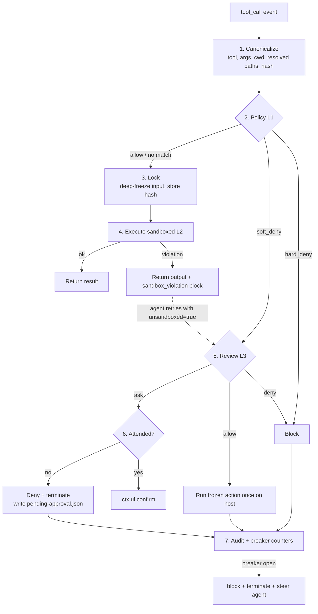

# pi-enclave

**Sandbox-first auto mode for [pi](https://github.com/badlogic/pi).**

An extension that lets you hand pi a task and walk away — with an OS-enforced sandbox as the
primary control, deterministic policy as the second, and an isolated model reviewer only for
what crosses the boundary. Designed to be trustworthy **offline, with open-weight models**.

> [!IMPORTANT]
> **Status: design proposal (v0.1). No implementation yet.**
> This README is the design document. It is published first so the architecture can be
> reviewed and argued with before any code exists. Nothing here is built; every section is
> a commitment to be tested, not a description of working software.

---

## Contents

- [Why this exists](#why-this-exists)
- [Goals and non-goals](#goals-and-non-goals)
- [Threat model](#threat-model)
- [Architecture](#architecture)
- [Sandbox backends](#sandbox-backends)
- [Pi integration](#pi-integration)
- [Policy model](#policy-model)
- [Reviewer](#reviewer)
- [Escalation and failure semantics](#escalation-and-failure-semantics)
- [Server-ops profile](#server-ops-profile)
- [Prior art, reuse and credits](#prior-art-reuse-and-credits)
- [Delivery plan](#delivery-plan)
- [Core changes to propose to pi](#core-changes-to-propose-to-pi)
- [Open questions and risks](#open-questions-and-risks)
- [License](#license)

---

## Why this exists

Two pi extensions already do tool-call gating, and both are good at what they do:

- **[pi-automode](https://github.com/czottmann/pi-automode)** has the best policy and
  configuration model — tiered rules (`hard_deny` / `soft_deny` / `allow`), `$defaults`
  extension, and shared project config that can only *add* restrictions. Its README states
  plainly that it is not a sandbox, and it has no denial circuit breaker.
- **[pi-approval-guardian](https://github.com/mics8128/pi-approval-guardian)** has the best
  integrity mechanics — direct-user-input provenance tracking, deep-frozen approved tool
  input, a fail-closed circuit breaker, and a reviewer restricted to read-only tools. Its
  coverage is narrower, it has no reviewer-driven `ask` outcome, and it is also not a sandbox.

Neither contains the piece that matters most. Both operate entirely inside the pi process:
an *approved* `bash` call still runs with the user's full privileges, so a single wrong
allow-decision can read `~/.ssh`, exfiltrate over the network, or modify the machine.

OpenAI Codex and Claude Code both converged on the same answer, and it is not a smarter
classifier — it is the kernel:

| | Mechanism |
|---|---|
| **macOS** | Seatbelt (`sandbox-exec`) with a generated deny-by-default profile |
| **Linux** | bubblewrap namespaces + seccomp BPF |
| **Network** | A local proxy that is the *only* egress path, enforcing a domain allowlist |
| **Model review** | Reserved for actions that want to cross that boundary |

pi-enclave adopts that shape and plugs it into pi's existing extension API — which already
exposes everything required: built-in tool overrides with pluggable operations, a
`user_bash` hook for `!` commands, a `tool_call` hook with `block` and `terminate`, and
`ctx.ui.confirm`.

> **Thesis.** Put the security in the kernel, the judgment in deterministic rules, and the
> model reviewer in the gap between them. With a local 8–30B reviewer that gap has to be
> small, because that reviewer is the most injectable component in the system.

---

## Goals and non-goals

### Goals

- Run pi unattended for a whole task with the same confidence as Codex `workspace-write`
  or Claude Code auto mode.
- Work **fully offline**: a local reviewer model, no cloud dependency anywhere in the
  control path.
- Native sandboxing on macOS and Linux; Docker as the portable fallback and the Windows answer.
- Cover *every* execution path pi has: built-in tools, `!` user bash, and — by policy —
  custom and MCP tools.
- Two first-class profiles: **dev** (workspace-write) and **ops** (offline server management).
- Exact action binding: what was approved is what runs, once.

### Non-goals

- Protecting against a malicious pi *extension* loaded into the same process. That requires
  isolating pi itself in a VM or container — documented as the outer ring, not solved here.
- Kernel-exploit-grade isolation. Seatbelt and bwrap are the bar; a microVM backend is a
  later option.
- A general DLP system. Secret handling is limited to path deny-lists and proxy-side
  credential masking.
- Native Windows sandboxing. On Windows the answer is the Docker backend.

---

## Threat model

| Threat | Primary control | Backup |
|---|---|---|
| Prompt injection via repo files, tool output, or fetched content steering the agent to run `curl … \| sh`, read `~/.ssh`, or push secrets | Sandbox: filesystem deny-read on secrets, no network except the proxy allowlist | Deterministic hard-deny rules; reviewer |
| Injection aimed at the **reviewer** (text in arguments or messages telling it to allow) | Reviewer sees structured, provenance-labelled evidence only; only direct TUI/RPC input can carry authorization | Sandbox limits the blast radius of a wrong allow |
| Honest agent mistake (`rm -rf` on the wrong path, `git push --force`) | Deterministic soft-deny → `ask` | Sandbox write roots |
| Workaround loops after a denial (same goal, different command) | Circuit breaker: `block` + `terminate` after N equivalent denials | Audit log |
| TOCTOU: input mutated between approval and execution by a later `tool_call` handler | Canonicalize → hash → deep-freeze → execute the frozen snapshot | Refuse auto mode when untrusted repo-local extensions are loaded |
| Reviewer outage (local model OOM, runtime restart) | Bounded retry, then deny and stop the turn (unattended) or `ask` (attended) | — |
| Sandbox bypass through tools that do not go through `bash` (custom / MCP tools) | Auto mode denies any tool not in the allowlist; allowlisted tools are declared read-only or reviewed | Outer container or VM |

---

## Architecture

Four layers, evaluated in order for every action. Cheaper and more deterministic layers run
first; the model runs last, and only when the earlier layers could not decide.

| Layer | Name | What it does |
|---|---|---|
| **L1** | Deterministic rules | Pattern rules on tool and arguments: `hard_deny`, `soft_deny` (→ ask), `allow`, plus protected paths. Never touches a model. Decides the majority of calls in under a millisecond. |
| **L2** | **OS enforcement** | Every shell command and file operation executes inside a Seatbelt / bwrap / Docker boundary: read-only root, explicit writable roots, secrets denied for reading, network only via the egress proxy. An L1 `allow` still lands here. Sandbox denials are returned to the agent as a structured violation, which is the *only* way a request can reach L3. |
| **L3** | Isolated model reviewer | Only for boundary crossings: "retry this exact command unsandboxed", a soft-deny hit, or a write outside the workspace. Fresh completion, own system prompt, structured evidence, strict JSON output with `allow` / `deny` / `ask`. |
| **L4** | Human escalation | Attended: `ctx.ui.confirm` with the exact canonical action. Unattended: `ask` means deny, stop the turn, and write a resumable "needs approval" record. |

Three cross-cutting mechanisms: the **action lock** (canonical snapshot, hashed, frozen,
executed once), the **circuit breaker** (per-turn and sliding-window denial counters), and
the **audit log** (JSONL, one record per decision, including sandbox violations).

### Decision path for one tool call



Step 7 matters as much as the rest: when the breaker opens, the agent is steered with
"do not pursue this outcome by other means" — the denial is about the *outcome*, not the
particular command.

---

## Sandbox backends

The backend is a small interface. The profile — what is readable, writable and reachable —
is backend-independent and compiled per backend at session start. Selection order:
native for the host OS → Docker → **refuse to enter auto mode**. There is no silent
unsandboxed fallback.

```ts
interface SandboxBackend {
  readonly id: "seatbelt" | "bwrap" | "docker";
  probe(): Promise<{ ok: boolean; reasons: string[] }>;      // deps, userns, daemon…
  compile(profile: SandboxProfile): Promise<CompiledProfile>; // .sbpl / bwrap argv / docker spec
  run(action: LockedAction, compiled: CompiledProfile,
      io: { onData(b: Buffer): void; signal?: AbortSignal; env: NodeJS.ProcessEnv })
    : Promise<{ exitCode: number | null; violations: Violation[] }>;
  // fs ops backing the read/edit/write/grep/find/ls overrides — same policy, no shell
  fs(compiled: CompiledProfile): ReadOperations & WriteOperations & EditOperations
                                 & GrepOperations & FindOperations & LsOperations;
}

interface SandboxProfile {
  mode: "read-only" | "workspace-write" | "custom";
  writableRoots: string[];   // workspace, scratch, $TMPDIR, optional extras
  readDeny: string[];        // ~/.ssh, ~/.aws, ~/.gnupg, ~/.pi/**/auth*, keychains…
  readAllow?: string[];      // custom mode only
  network: { mode: "off" | "proxy"; allowHosts: string[]; allowLocalPorts: number[] };
  strict: boolean;           // true = no unsandboxed retry hatch
  pty: boolean;
}
```

### macOS — Seatbelt

`sandbox-exec -p <generated SBPL> /bin/zsh -c …`, with a deny-by-default base modeled on
Codex's `seatbelt_base_policy.sbpl` (process-exec/fork, a sysctl allowlist, PTY access,
POSIX semaphores and shared memory for Python multiprocessing).

- **Filesystem** — `(allow file-read*)` minus `readDeny` subpaths; `(allow file-write*)`
  only on `writableRoots`, `/dev/null` and scratch.
- **Network** — denied entirely; in `proxy` mode, `network-outbound` to
  `localhost:<proxyPort>` only, plus the minimal mach-lookups needed for DNS and trust
  evaluation.
- **Caveats** — `sandbox-exec` is deprecated-but-universal (Chrome, Codex and Claude Code
  all rely on it). Homebrew under `/opt/homebrew` stays read-only, which is fine. Git
  worktrees outside the cwd need explicit `writableRoots`. Go's TLS stack needs `trustd`,
  which is exposed as an explicit weaker option, off by default.

### Linux — bubblewrap

`bwrap --unshare-user --unshare-pid --unshare-net --new-session --die-with-parent`,
`--ro-bind / /`, `--bind` for writable roots, `--tmpfs` over `readDeny` paths, plus
`--proc` and `--dev`. Seccomp BPF (via `--seccomp`) blocks new `AF_UNIX` and raw sockets
when proxying.

- **Filesystem** — same profile semantics; deny-read is implemented by masking with an
  empty tmpfs rather than by returning an error.
- **Network** — the network namespace is removed. In `proxy` mode a Unix domain socket is
  bound into the sandbox and bridged by `socat` to the host proxy (Claude Code's layout).
- **Caveats** — requires unprivileged user namespaces (Ubuntu 24.04's AppArmor policy may
  block them; `probe()` detects this and prints the sysctl fix). WSL1 is unsupported.
  On hosts without userns (Docker-in-Docker), fall through to the Docker backend rather
  than offering a "weaker nested" mode.

### Docker — fallback and Windows

A long-lived per-session container:
`docker run --rm -d --network none --cap-drop ALL --security-opt no-new-privileges --read-only --pids-limit …`
with the workspace bind-mounted; each action is a `docker exec`.

- **Filesystem** — bind mounts for writable roots, everything else from the image.
  `readDeny` is trivially satisfied: the host home directory is never mounted.
- **Network** — `--network none`, plus an optional sidecar proxy on a user-defined network
  for `proxy` mode.
- **Caveats** — the toolchain must exist in the image (project-defined `Dockerfile`, or a
  default). UID mapping is needed for file ownership. Startup is slower, amortized by the
  session-long container. On macOS, Docker Desktop is a VM — actually *stronger* isolation
  than Seatbelt, with slower I/O.

### Later — microVM

pi's bundled `gondolin` example already routes all built-in tools into a QEMU micro-VM
through the same operations interfaces, which proves the integration surface is sufficient.
Kept out of v1 for startup cost and its Node ≥ 23.6 requirement.

### Egress proxy

A small in-process HTTP CONNECT and SOCKS5 proxy on localhost, started with the session.
It enforces `network.allowHosts`, logs every connection, and (v2) substitutes masked
credentials on egress to allowed hosts only.

In `off` mode it is never started — the default for offline use. Local model endpoints
(`localhost:11434` and friends) are reached by **pi itself**, not from inside the sandbox,
so the sandbox needs no network at all for the agent to work.

---

## Pi integration

Everything below uses APIs that exist in pi today.

| Need | Pi API | How pi-enclave uses it |
|---|---|---|
| Sandbox shell commands | `registerTool({ name: "bash", … })` built from `createBashTool({ operations, spawnHook })` | Override the built-in `bash`. The operations object delegates to `backend.run`. Renderers are inherited; `promptSnippet` and `promptGuidelines` are re-declared so the model learns about `unsandboxed` and the violation format. |
| Sandbox file tools | `createReadTool` / `EditTool` / `WriteTool` / `GrepTool` / `FindTool` / `LsTool` with their `*Operations` | Same profile, enforced in-process by resolved-path checks — no shell spawn, so read-only tools stay fast. |
| `!` and `!!` user commands | `on("user_bash")` | Routed through the same backend. Guardian lists this as an uncovered bypass; here it is covered by construction. |
| Policy, lock, review, breaker | `on("tool_call")` → `{ block, reason, terminate }` | One handler running steps 1–3 and 5–7. `terminate: true` when the breaker opens. |
| Direct-user provenance | `on("input")`, `on("message_start")` | Record exact pre-expansion TUI/RPC text; only those messages count as authorization evidence. |
| Ask the human | `ctx.ui.confirm(title, message)`, `ctx.hasUI` | Attended escalation. `hasUI === false` implies unattended semantics. |
| Steer after a breaker trip | `pi.sendMessage(…, { deliverAs: "steer" })`, `ctx.abort()` | Tell the agent the *outcome* is off-limits, not just the command. |
| Persistence | Session entries, `session_start` / `session_shutdown` | The per-session approval table and breaker state survive resume; a bypass never does. |
| Commands and status | `registerCommand`, status line | `/enclave status\|on\|off\|profile <name>\|model\|backend\|violations`; the footer shows backend, mode and counts. |

> [!WARNING]
> **Tools pi-enclave does not own.** Custom tools from other extensions and MCP servers
> execute in the pi process with the user's privileges and never touch the sandbox. In auto
> mode the policy layer therefore **denies any tool not in `tools.allow`**. Allowlisted
> tools must be declared `readOnly: true` (then allowed) or `reviewed: true` (every call
> goes to L3). This is the honest answer until pi core offers a sandbox hook for tool
> execution — see [core changes](#core-changes-to-propose-to-pi).

---

## Policy model

Adopts pi-automode's structure almost verbatim, because it is already right: tiered rules,
`$defaults` extension, and shared project config that can only *add* restrictions.

| Source | Location | May | May not |
|---|---|---|---|
| Built-in defaults | package | — | — |
| User global | `~/.pi/agent/enclave.json` | Everything: profiles, backend, reviewer model, allow rules, tool allowlist | — |
| Project local (untracked) | `.pi/enclave.local.json` | Select a profile, add writable roots *inside* the repo, add deny/ask rules | Add allow rules, change the reviewer, disable the sandbox |
| Project shared (tracked) | `.pi/enclave.json` | Add deny/ask rules, add protected paths, declare the Docker image | Anything that relaxes policy; ignored entirely if the project is not trusted |
| Environment | `PI_ENCLAVE_*` | Override model, profile, unattended flag (for CI and ops runners) | — |

```json
{
  "profile": "dev",
  "profiles": {
    "dev": {
      "sandbox": {
        "mode": "workspace-write",
        "writableRoots": ["$WORKSPACE", "$TMPDIR", "~/.cache/pi-enclave"],
        "readDeny": ["$defaults"],
        "network": { "mode": "off" },
        "strict": false
      },
      "rules": {
        "hard_deny": ["$defaults"],
        "soft_deny": ["$defaults", "git push --force*", "docker system prune*"],
        "allow":     ["npm test*", "npm run build*", "git commit*"]
      },
      "tools": {
        "allow": { "bash": {}, "read": {}, "edit": {}, "write": {},
                   "grep": {}, "find": {}, "ls": {} }
      },
      "reviewer": { "model": "ollama/qwen3:32b", "timeoutMs": 30000, "fallback": "none" },
      "breaker": { "consecutive": 3, "window": [10, 50] },
      "unattended": "auto"
    }
  }
}
```

Rule matching runs against the canonical action, not raw text: shell commands are tokenized
(pipelines, `&&` and subshells split, each simple command matched) and paths are resolved.
This is the same heuristic both existing extensions use; v2 can swap in a real shell parser
without changing the rule format.

---

## Reviewer

The reviewer is where the existing extensions put most of their effort. Here it carries the
*least* load, on purpose.

- **Isolated.** A fresh completion through pi's model registry with pi-enclave's own system
  prompt. No session system prompt, no memories, skills, extensions, MCP, or tools in v1.
  (Guardian's read-only reviewer tools are a v2 option, behind the same sandbox profile.)
- **Explicit model, no silent fallback.** `reviewer.model` must be set to enter auto mode.
  `fallback: "none"` is the default; the only other value is another explicit model. Never
  the session model.
- **Structured evidence, labelled by provenance.** The prompt's user turn is a JSON
  document, not prose:

```json
{
  "action": {
    "tool": "bash",
    "argv": ["git", "push", "--force", "origin", "main"],
    "cwd": "/w/app",
    "hash": "sha256:…",
    "trigger": "soft_deny:git push --force*"
  },
  "violation": null,
  "authorization": [
    { "provenance": "direct",
      "text": "rebase my branch and force push it, I'm the only one on it" }
  ],
  "context": [
    { "provenance": "assistant_tool_call", "tool": "bash", "argv": ["git", "rebase", "main"] }
  ],
  "profile": { "name": "dev", "unattended": false }
}
```

`authorization` contains **only** direct TUI/RPC user input, verbatim. `context` is bounded,
untrusted, and present for disambiguation only.

- **Not sent:** `AGENTS.md` and other project instruction files, tool results, assistant
  prose, skill expansions. Guardian currently forwards assistant and tool-result messages
  unfiltered; automode already excludes them — pi-enclave follows automode.
- **Output:** strict JSON, fixed key order —
  `{"decision":"allow"|"deny"|"ask","risk":"low"|"medium"|"high"|"critical","reason":"…"}`.
  Consistency rules borrowed from guardian: `allow` with `critical` is a parse failure, and
  `allow` with `high` requires a `direct` authorization entry to be present.
- **Two-stage for small models** (from automode): a one-token gate ("does the direct
  authorization plausibly cover this action? 0/1"), then the structured decision. This keeps
  the total prompt under roughly 2k tokens, so a local model answers in seconds.
- **Evaluated before trusted.** Ship a corpus (~60 cases: benign, destructive,
  injected-authorization, injected-arguments) and a `pi enclave eval-reviewer` command.
  A model that allows *any* injected case is refused as a reviewer, with a clear message.
  This is the offline substitute for "product-validated reviewer models".

---

## Escalation and failure semantics

### The unsandboxed retry hatch

When a command fails on a sandbox violation, the agent sees this appended to the output:

```
<sandbox_violation backend="seatbelt">
  denied: file-write /Users/m/.zshrc
  hint: if this write is required for the task, retry with unsandboxed=true
        and state why; it will be reviewed.
</sandbox_violation>
```

A retry with `unsandboxed: true` is a boundary crossing: it always goes to L3, a reviewer
`allow` runs exactly that hash once on the host, `ask` escalates, and `deny` counts toward
the breaker. Setting `strict: true` in the profile removes the hatch entirely (the
equivalent of Claude Code's `allowUnsandboxedCommands: false`) — recommended for the ops
profile.

### Outcome matrix

| Event | Attended (TUI) | Unattended (RPC, `hasUI=false`, or forced) |
|---|---|---|
| Reviewer returns `ask` | `ctx.ui.confirm` showing the canonical action and reason | Deny, `terminate`, and write `.pi/enclave/pending-approval.json` with the hash so a human can approve and resume |
| Reviewer timeout or error | Retry ×3 with backoff, then treat as `ask` | Retry ×3, then deny and terminate (counts as adverse for the breaker) |
| Reviewer output unparsable | Deny — fail closed. Never re-prompt the reviewer with "fix your JSON"; that is an injection vector. | Same |
| Breaker opens | `block` + `terminate`, plus a steer message naming the denied *outcome*. Resets on the next direct user input. | Same |
| Backend `probe()` fails | Auto mode refuses to turn on; the status line shows why and the fix. No degraded mode. | Same |
| Untrusted repo-local extension loaded | Auto mode refuses to turn on — such an extension can register its own `tool_call` handler or override `bash`. | Same |

### Circuit breaker

Taken from guardian: open after 3 consecutive adverse outcomes in a turn, or 10 adverse
outcomes in the last 50 batches. Denials, timeouts, failures and sandbox violations on retry
all count. A batch of parallel tool calls collapses into a single outcome, so one denied
batch does not trip it.

---

## Server-ops profile

The second use case — managing servers that must stay offline — needs real privileges on the
host, which a workspace sandbox cannot express. The approach is to **shrink the action space
rather than widen the sandbox**.

**Sandbox shape**

- Mode `custom`: `writableRoots` are the exact config trees in scope (`/etc/nginx`,
  `/etc/systemd/system`, `/var/lib/app`), and nothing else.
- `readDeny` keeps `/etc/shadow`, `/root`, key material, and other services' secrets out.
- `network.mode: "proxy"` with `allowHosts` set to the hosts this runner manages; `off` when
  operating on a single host.
- `strict: true` (no unsandboxed hatch) and `unattended: true`.

**Narrow tools instead of raw bash**

- `service(unit, start|stop|restart|reload|status)` — allowlisted units, backed by a
  `sudoers` rule scoped to `systemctl <verb> <unit>`.
- `apply_config(path, content)` — writes with backup and diff, validates (`nginx -t`),
  reloads, and rolls back on failure. Only paths under `writableRoots`.
- `ssh(host, argv)` — hosts from config, keys constrained with `command=` and `restrict` in
  `authorized_keys`.
- `bash` remains available but read-only by policy (`hard_deny` on writes and sudo). The
  narrow tools are the only mutation path, and each is `reviewed: true` for anything that is
  not idempotent.

The real guardrails here are `sudoers`, SSH key restrictions and backups — the same things
you would give a junior operator. pi-enclave's job is to make the agent's mutation surface
small enough that deterministic policy covers nearly all of it, so the local reviewer only
ever sees the rare `reviewed` call. pi itself should run as a dedicated low-privilege user.

---

## Prior art, reuse and credits

pi-enclave is deliberately not written from scratch. Both reference extensions and both
reference sandboxes are permissively licensed, and the intent is to reuse their best parts
with attribution rather than reinvent them.

| Component | Source | Notes |
|---|---|---|
| Config layering, `$defaults`, tighten-only project rules, rule tiers, default rule lists | pi-automode — `config.ts`, `constants.ts`, `permissions.ts`, `hard-deny.ts` | Port; add `profiles`, `sandbox` and `tools` sections |
| Two-stage classifier, transcript budgeting, strict key-order JSON parsing | pi-automode — `classifier.ts`, `transcript.ts` | Port; change evidence to structured JSON; add `ask` |
| Input lock (`assertJsonLike` + recursive freeze + non-writable property) | pi-approval-guardian — `tool-input-lock.ts` | Port as-is; add the canonical hash |
| Direct-user provenance tracker | pi-approval-guardian — `authorization-provenance.ts` | Port as-is |
| Circuit breaker, batch collapsing, retry with backoff | pi-approval-guardian — `gate.ts` | Port; wire up `terminate` and steering |
| Path sensitivity rules (private-only, shell profiles, pi paths) | pi-approval-guardian — `path-rules.ts` | Becomes the default `readDeny` list |
| Seatbelt base policy | OpenAI Codex — `seatbelt_base_policy.sbpl`, `seatbelt_network_policy.sbpl` | Apache-2.0; vendor the base with its header, generate filesystem and network clauses in TS |
| bwrap argv and seccomp layout, UDS proxy bridging | OpenAI Codex `linux-sandbox`; Anthropic `sandbox-runtime` | Reference designs; reimplement in TS, or depend on `@anthropic-ai/sandbox-runtime` directly if its API stabilizes |
| Backend interface, tool overrides, `user_bash` routing, Docker backend, ops tools, eval corpus | **new** | The actual contribution |

Both pi-automode and pi-approval-guardian are MIT-licensed; Codex and sandbox-runtime are
Apache-2.0. Apache-2.0 material will live under `third_party/` with its original license
header and attribution preserved, alongside a `NOTICE` file.

---

## Delivery plan

Ordered so each phase is independently useful and the riskiest part — the sandbox — is
validated first.

### Phase 1 — Sandbox core

*Outcome: every pi command on macOS and Linux runs in workspace-write with no network. No
model involved yet.*

- `SandboxBackend` interface, `seatbelt` and `bwrap` backends, `probe()` diagnostics.
- Override `bash` and the six file tools; route `user_bash`.
- Violation reporting in tool output; `/enclave status|backend`.
- Test matrix: write outside root, read `~/.ssh`, `curl`, spawn a PTY (`vim`), Python
  multiprocessing, git worktree outside cwd.

### Phase 2 — Policy, lock, breaker

*Outcome: deterministic auto mode — usable offline with no reviewer at all, where soft-deny
becomes ask or deny.*

- Port automode's config and rules; port guardian's lock, provenance and breaker.
- Tool allowlist enforcement for custom and MCP tools; untrusted-extension refusal.
- Attended and unattended outcome matrix; pending-approval record; audit JSONL.

### Phase 3 — Reviewer

*Outcome: boundary crossings get a model opinion, and small local models are admitted only
after passing the eval.*

- Structured-evidence prompt, two-stage flow, `allow`/`deny`/`ask`, unsandboxed retry hatch.
- Eval corpus and `eval-reviewer` command; publish results for local models (Qwen3, Gemma,
  gpt-oss, Llama) and cloud ones.

### Phase 4 — Ops profile

*Outcome: unattended server management on an offline host.*

- `custom` sandbox mode, `strict`, the `service` / `apply_config` / `ssh` tools, plus
  `sudoers` and `authorized_keys` templates and documentation.

### Phase 5 — Docker backend and egress proxy

*Outcome: Windows and locked-down Linux hosts; allowlisted network for online use.*

- Session container lifecycle, project `Dockerfile` support, UID mapping.
- CONNECT/SOCKS5 proxy, per-host allowlist, credential masking.

---

## Core changes to propose to pi

All of the above works as an extension, but three small core changes would make any
reviewer or sandbox extension *robust* rather than merely careful:

1. **Ordered or final `tool_call` handlers.** Today handlers run in extension load order,
   and later handlers may mutate `event.input` with no re-validation — pi's own
   `types.ts` documents this. Either a `priority` option, or a post-mutation
   `tool_call_final` event that sees the exact input about to execute.
2. **`ask` as a first-class `ToolCallEventResult`**, with a defined unattended fallback, so
   every mode (TUI, RPC, print) behaves identically.
3. **An execution-boundary hook for custom tools** — or a "run this tool through this
   wrapper" option — so MCP and custom tools can be sandboxed instead of merely allowlisted.

Items 1 and 2 can be prototyped in a fork while the extension ships, then upstreamed with
pi-enclave as the motivating use case.

---

## Open questions and risks

- **Depend on `@anthropic-ai/sandbox-runtime`, or own the backends?** Depending saves the
  Seatbelt/bwrap/proxy work and tracks upstream fixes; owning keeps control of the profile
  format and avoids an alpha-API risk. Current lean: prototype Phase 1 against srt, and own
  it only if its profile model cannot express `readDeny` *inside* `writableRoots` or the ops
  `custom` mode.
- **Shell parsing fidelity.** Heuristic tokenization will miss `$(…)`, `eval` and heredocs.
  The sandbox is the real control, which mitigates this — but the ops profile's `hard_deny`
  on writes via bash does depend on it. Consider a real parser (tree-sitter-bash WASM) in v2.
- **macOS Seatbelt longevity.** Apple could remove `sandbox-exec`. The Docker backend is the
  contingency, which is why it is in scope rather than "maybe later".
- **Reviewer quality floor.** If no local model passes the eval on the user's hardware,
  Phase 2's deterministic auto mode is the fallback: useful, but every soft-deny becomes an
  `ask`. That is the honest offline ceiling and should be presented as such.
- **Performance.** Seatbelt and bwrap add roughly 10–50 ms per command; `docker exec` adds
  more. File tools run in-process, so reads stay fast. To be measured in Phase 1.

---

## License

[MIT](LICENSE) — matching pi and the wider pi extension ecosystem.
